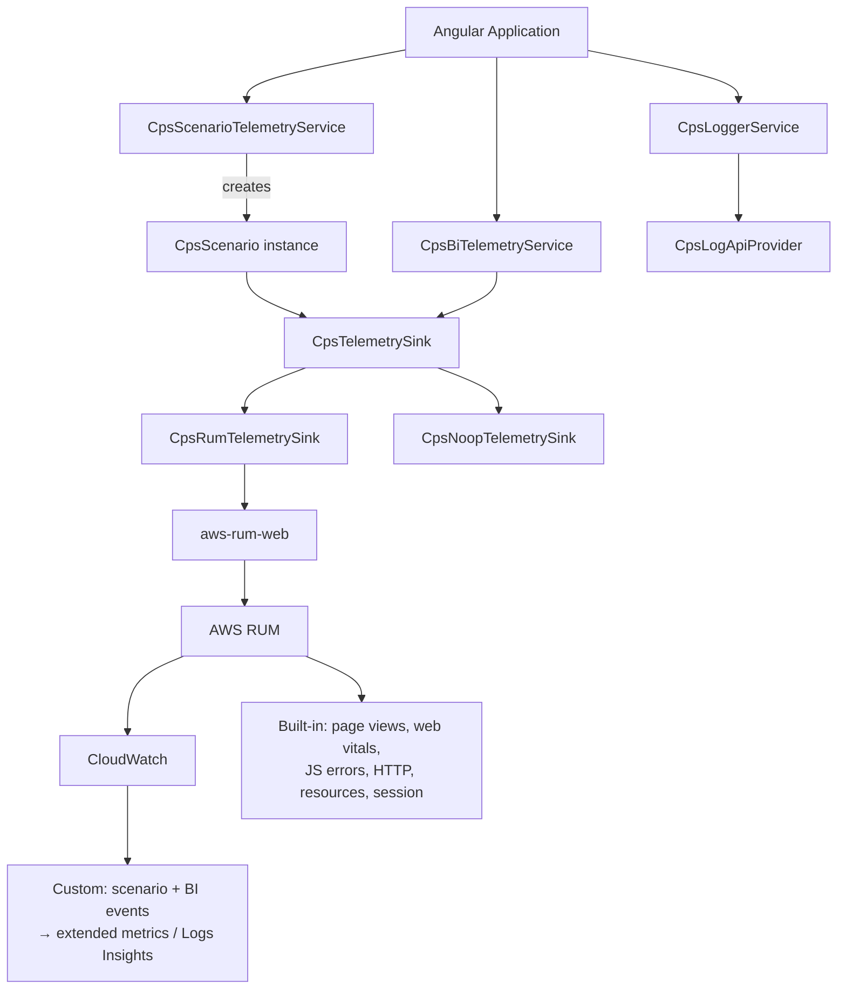
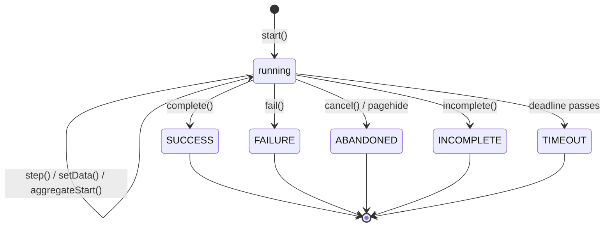
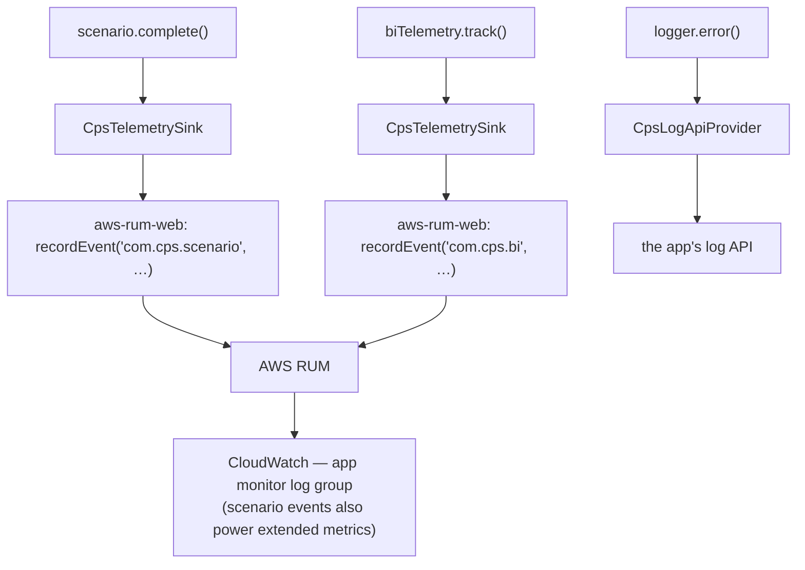
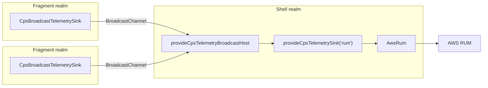

# cps-telemetry — development design

A reusable Angular telemetry layer covering three separate concerns —
application logs, scenario health telemetry, and business/UX events — built
on a shared internal abstraction, with an AWS CloudWatch RUM sink.

---

## 1. Goals

- **Scenario health.** Measure whether a user journey (load customer data,
  open a report, submit a search, export data) succeeded, how long it took,
  and where the time went — so a regression shows up as a metric, not as a
  support ticket.
- **Correlated diagnostics.** When a journey fails, make it possible to pull
  the frontend logs, the frontend telemetry, and the backend logs for _that
  one run_, using a single identifier.
- **Code-level diagnostics.** A scenario's status tells you a journey broke;
  logs tell you where in the code and why. Both carry the same
  `correlationId`, so together they read as one trail — from "what failed"
  to "what the code was doing when it did."
- **Product signal.** Record feature adoption and interaction events without
  putting business vocabulary inside the telemetry infrastructure itself.
- **Developer debugging.** Let any developer see exactly what telemetry is
  being produced, in any environment, just by setting a LocalStorage flag —
  no rebuild, no config change, no production switch.
- **Reusability.** Ship as a library another Angular application can install
  and configure, with no trace of the Composition application inside it.
- **Safety.** Telemetry can never break the application, and it never
  quietly leaks sensitive data.

## 2. Non-goals

Explicitly out of scope:

- Backend telemetry or log-ingestion APIs.
- CloudWatch infrastructure, dashboards, alarms, or metric definitions.
- Lambda, API Gateway, IAM policies, CDK/Terraform.
- Backend log storage or retention policy.
- Session replay — recording and replaying a user's on-screen session as
  video, DOM mutations and all. RUM supports it; we do not enable it.
- A general-purpose observability platform. This is a small library.

We assume the backend RUM credential broker and the log store already exist:
the library just defines `CpsLogApiProvider`, and the consuming application
implements it. Nothing here mocks either one — a library that ships a fake
backend is shipping a lie about what it actually does.

---

## 3. Proposed architecture



### Components

| Component                     | Responsibility                                                                                   |
| ----------------------------- | ------------------------------------------------------------------------------------------------ |
| `CpsLoggerService`            | Structured `log`/`warn`/`error`, plus child loggers with a bound correlation id                  |
| `CpsScenarioTelemetryService` | Creates scenarios; flushes any still-running ones at page unload                                 |
| `CpsScenario`                 | One independent journey — its steps, aggregates, and outcome                                     |
| `CpsBiTelemetryService`       | Discrete business/UX events, deduplicated within a short window                                  |
| `CpsTelemetrySink`            | Abstract destination for scenario and BI events                                                  |
| `CpsRumTelemetrySink`         | The AWS RUM adapter — lazy SDK load, credentials, a pre-init buffer, and flushing                |
| `CpsNoopTelemetrySink`        | Explicit opt-out — everything runs, nothing ships                                                |
| `CpsLogApiProvider`           | The seam where the application supplies its own log store — send, query, and an optional `flush` |
| `CpsRumCredentialsProvider`   | The seam where the application supplies its AWS details                                          |

### Shared infrastructure

`CpsTelemetryIdentity` + `CPS_TELEMETRY_IDENTITY` (identity, shared by every
concern), `CPS_LOG_CONFIG` / `CPS_SCENARIO_CONFIG` / `CPS_BI_CONFIG` /
`CPS_REDACT_CONFIG` (one per concern), `CpsTelemetryMetadata`,
`cpsIsDebugEnabled`, `cpsRedactMetadata` / `cpsNormalizeError` /
`cpsScrubString` / `cpsRedactConfigFor`, `cpsSafe` / `cpsSafeVoid` /
`cpsUuid` / `cpsNow`.

Everything is wired through Angular DI, so the AWS implementation can be
swapped out in production and stubbed in tests.

### Entry points

Just one: `cps-telemetry`. The public barrel lists its exports one by one
rather than re-exporting whole modules — this is a published package, so
every exported name is a permanent compatibility promise. Id generation, the
clock, the fail-open wrappers, user timings, and the broadcast channel
plumbing all stay internal, so they can change freely without a breaking
release. Redaction is the exception: an author writing a custom sink needs
`cpsRedactMetadata`, `cpsNormalizeError`, `cpsScrubString` and
`cpsRedactConfigFor`, so those are exported.

**Test doubles are not shipped, and do not get their own folder or file.** A
`RecordingSink` or `ThrowingSink` is declared inline, at the top of whichever
spec needs it — duplicated per file rather than shared, since a double used
by one or two consumers does not earn its own abstraction. None of them are
exported. They exist purely to test _this library_; the one browser gap that
still needs a stub is `BroadcastChannel`, which jsdom does not implement at
all, and even that is just a small inline stub in `cps-broadcast.spec.ts`
rather than a dedicated file. An application testing its own code needs a
five-line provider array and, if it wants to assert on emitted events, a
six-method sink double — both are shorter to write than to depend on, and
neither one then constrains this package's API. The build confirms the
separation: none of this appears in the emitted bundle or the `.d.ts`.

---

## 4. Data model

### Log record

```ts
interface CpsLogRecord {
  timestamp: string; // ISO-8601
  level: 'log' | 'warn' | 'error';
  message: string; // scrubbed, length-capped
  logger?: CpsLoggerName; // which part of the app wrote it
  context?: string; // free-form subsystem label
  metadata?: CpsTelemetryMetadata;
  error?: CpsTelemetryError;
  correlationId?: string; // usually a scenarioId
  application: string;
  environment: string;
  version: string;
  userId?: string;
  sessionId?: string; // taken from the sink, so logs join the RUM stream
}
```

Only `timestamp`, `level`, `message`, and the application identity are
always present. `logger.log('message')` is a complete, valid call on its
own.

### The name vocabulary

Scenario names, step names, aggregate names, and logger names are all finite
types, not plain `string`:

```ts
// declared by the library, empty
interface CpsScenarioNames {}
interface CpsScenarioSteps {}
interface CpsLoggerNames {}

type CpsScenarioName = keyof CpsScenarioNames extends never
  ? string
  : keyof CpsScenarioNames;
```

Scenario, step, and aggregate names are metric dimensions. A misspelled one
does not produce a wrong figure — it silently starts a second, incomplete
series, and the alarm built on the first one keeps reading healthy. An
interpolated id causes the exact same problem, just with unlimited possible
values. Both are now compile errors instead.

A logger name fails differently, but no better: it is the key every record
carries to the backend, so a typo means a whole stream quietly lands in the
wrong place.

A published package cannot know the names an application will use in
advance, so the registries above start out empty, and the **consuming
application declares its own vocabulary** in a schema file that augments
them:

```ts
declare module 'cps-telemetry' {
  interface CpsScenarioSteps {
    'resolve-route': true;
  }
}
```

`keyof` an empty interface is `never`, which would make every call
uncallable — hence the fallback to `string`. Adoption is therefore opt-in
and incremental: names are unconstrained until the first augmentation, then
fully checked from then on. Steps and aggregates share one registry because
they name the same kind of thing — a name declared for a step is just as
valid passed to `aggregateStart`.

The library never writes any log lines of its own, so `CpsLoggerName` is
exactly whatever the application declares — there are no reserved names to
work around.

### Scenario

```ts
interface CpsScenarioRecord {
  scenarioId: string; // uuid — the correlation id
  parentScenarioId?: string;
  scenarioName: CpsScenarioName;
  feature?: string;
  operation?: string;
  route?: string;
  status?: CpsScenarioStatus; // undefined on a toRecord() snapshot taken mid-flight
  statusCode?: string | number; // HTTP status or business code
  message?: string;
  reason?: string; // structured, low-cardinality — independent of message
  error?: CpsTelemetryError;
  startTime: string; // ISO-8601
  endTime?: string; // ISO-8601; wall-clock position, not a duration
  delta: number; // ms — total duration, the headline latency measure
  elapsed: number; // ms since this page loaded, at settle — a timeline position
  stepCount: number;
  steps: CpsScenarioStep[]; // forensics in a log query, not metric material (§7)
  exceededStepsLimit?: boolean; // steps[] truncated at maxSteps
  previousStep?: CpsStepName; // last real step closed before settling
  aggregates?: CpsScenarioAggregate[];
  metadata?: CpsTelemetryMetadata;
  application: string;
  sessionId?: string;
  userId?: string;
}

interface CpsScenarioAggregate {
  name: CpsStepName; // shares the step vocabulary
  elapsed: number; // summed across every call
  callCount: number;
}
```

An aggregate is reported separately from steps because it has a duration but
no position on the timeline — it is for work that runs many times inside one
scenario, where the total is the useful number and a hundred individual
steps would just be noise.

**No `spanId` field.** A 16-hex W3C/X-Ray-format trace span id, separate from
`scenarioId` (the journey correlation id), would only earn its place if it
actually lined a scenario up against a distributed trace — nothing in any
consuming application wires it into an X-Ray header, and nothing else in
this library reads one either. Shipping it anyway would be dead weight on
every event, for a use case nobody exercises. It can be added the day
something actually threads it through.

**`application`, `sessionId` and `userId` are on this record.** The
alternative — relying on the fact that AWS's own `Dispatch.js` already
attaches `UserDetails: { userId, sessionId }` to _every_ `PutRumEvents`
request, so leaving them off the payload body would save real bytes against
the 200-event session cap — is a real saving, but it loses to a bigger cost:
a payload that makes you cross-reference the outer request envelope just to
answer "who did this, which session, which app" is a worse experience when
you are reading the record directly, whether in a Logs Insights query against
the event body or in any consumer that only ever sees the payload.
Consequently, the extra bytes win. `sessionId` and `userId` stay optional at the type level:
`sessionId` genuinely is not there before the RUM client finishes
initializing, and `userId` only exists once someone has signed in.

`CpsLogRecord` carries both too, but for a related, distinct reason: logs go
straight to a backend of the application's own choosing, with no RUM
envelope to inherit identity from at all — so the record has to state it
outright.

### Scenario step

```ts
interface CpsScenarioStep {
  name: CpsStepName | 'scenario-start' | 'scenario-end';
  startOffset: number; // ms from scenario start, not an epoch
  endOffset?: number;
  stepDelta?: number; // this step's own duration
  elapsed?: number; // ms since page load, at step close — a timeline position
  status?: CpsScenarioStepStatus; // same union as the scenario
  message?: string;
  reason?: string; // structured, low-cardinality — independent of message
  error?: CpsTelemetryError;
  metadata?: CpsTelemetryMetadata;
}
```

Offsets are relative to the scenario's own start, so they stay as small
integers. That matters because every step ships inside the scenario event's
own payload.

`elapsed`/`stepDelta` split the same way the record's own `elapsed`/`delta`
do, and for the same reason: a duration and a timeline position are
different questions, and should not share one name. `delta` names a duration
on the scenario; `stepDelta` names the same idea on a step.

**Once a scenario settles, `steps` has at least two entries.** Two
zero-duration markers bookend whatever real steps the caller declared:
`scenario-start`, written in the constructor, and `scenario-end`, written at
settlement, carrying the scenario's own final status plus whichever of
`message`/`metadata`/`error` the settle-time `CpsScenarioOutcome` supplied.
That is the same detail that also closes whatever real step was still open,
and that lands on the record's own root fields. All three views agree with
each other, so reading `steps[]` alone tells the full story without
cross-referencing the root record. A scenario that never calls `.step()`
still gets exactly the two boundary markers once it settles. Neither counts
toward `stepCount`, `exceededStepsLimit` or `maxSteps` — that budget is only
about steps the caller actually opened. The type allows the two literal
names alongside `CpsStepName` rather than requiring every consuming
application to register them, because they are the library's own to write,
not the application's to declare.

`scenario-end` is only written at settlement, so this two-entry minimum is a
property of a _settled_ record, not a guaranteed one: `toRecord()` is public
and safe to call on a still-running scenario, and a snapshot taken before
the first `.step()` call — before `scenario-end` exists — can have as few as
one entry (just `scenario-start`).

### BI event

```ts
interface CpsBiEvent {
  eventName: string; // supplied by the application
  eventTime: string;
  scenarioId?: string; // optional correlation to a journey
  feature?: string;
  // no `route` — the RUM envelope's pageId already carries the page
  metadata?: CpsTelemetryMetadata;
  application: string;
}
```

`application` is here for the same self-describing-payload reason as the
scenario record. `sessionId`/`userId` were not asked for on BI events, and the
same "AWS already has it" argument applies here unweakened — so they were
left off.

### Fields deliberately left out

The brief suggested several fields that are **not** collected. Each has its
own reason:

| Omitted                            | Why                                                                                                                                                                                                                                                                                                                                                                                                                                                                                                                                                                                                                                                                                                                                                                                                                      |
| ---------------------------------- | ------------------------------------------------------------------------------------------------------------------------------------------------------------------------------------------------------------------------------------------------------------------------------------------------------------------------------------------------------------------------------------------------------------------------------------------------------------------------------------------------------------------------------------------------------------------------------------------------------------------------------------------------------------------------------------------------------------------------------------------------------------------------------------------------------------------------ |
| `device`, `browser`, `page`        | The RUM envelope already attaches `browserName`, `browserVersion`, `osName`, `osVersion`, `deviceType`, `pageUrl`, `pageId`, `countryCode`, `referrerUrl` to _every_ event. Repeating them would just be duplicated payload against a capped event budget.                                                                                                                                                                                                                                                                                                                                                                                                                                                                                                                                                               |
| `sessionId`, `userId` on BI events | Already carried once per session via `addSessionAttributes` for every event type, BI included. The scenario record makes the opposite trade for these two specifically — see above for why.                                                                                                                                                                                                                                                                                                                                                                                                                                                                                                                                                                                                                              |
| `environment`, `version` on events | Same session-attributes argument. `application` is the one exception here (see above); `environment`/`version` stay off both records. **Except when forwarded across realms**: the host records through _its own_ client, so `CpsBroadcastTelemetrySink` stamps its own `application`/`environment`/`appVersion` onto each forwarded event's _metadata_ — a second, independent place a fragment's identity ends up, since the host has no other way to tell which fragment sent it (§13). A forwarded **error** has no metadata field to carry this in — `AwsRum.recordError(error: any)` takes no second argument at all — so `CpsRumTelemetrySink` instead folds a differing origin into the error's own `name` (e.g. `[fragment-app] TypeError`) rather than silently attributing every fragment error to the shell. |
| `networkType`                      | The Network Information API is Chromium-only and its values are coarse and unreliable — a metric nobody can trust across browsers is worse than no metric at all.                                                                                                                                                                                                                                                                                                                                                                                                                                                                                                                                                                                                                                                        |
| `timeToStart`                      | RUM's built-in navigation timing already answers "how long until the app was interactive".                                                                                                                                                                                                                                                                                                                                                                                                                                                                                                                                                                                                                                                                                                                               |
| Separate `latency`                 | For a scenario that is `delta`; for a step it is the step's own `stepDelta`. A third name for the same number would just invite inconsistent dashboards.                                                                                                                                                                                                                                                                                                                                                                                                                                                                                                                                                                                                                                                                 |

---

## 5. Lifecycle



**Valid transitions.** A running scenario can go to exactly one of
`success`, `failure`, `abandoned`, `incomplete`, or `timeout`. Nothing else.

`timeout` is a deliberate fifth status, split out of `abandoned` — see
below. There is no "in progress" status at all. A running scenario has no
status: `CpsScenario.status` is `undefined` until it settles, and
`isSettled` is just derived from that same field (`status !== undefined`)
rather than tracked as a second, separate boolean that could drift out of
sync with it.

Nothing is emitted at start either, in any mode: a scenario that has not
settled has no status to report yet, so a start event would have nothing to
say.

**Why there are four unsuccessful outcomes, not one.** Each demands a
different response, and collapsing them together would make the failure
rate useless for alerting:

| Status       | Meaning                                                                                              | Response                                                                |
| ------------ | ---------------------------------------------------------------------------------------------------- | ----------------------------------------------------------------------- |
| `failure`    | A defect — the journey broke                                                                         | Investigate; page someone if the rate spikes                            |
| `abandoned`  | The journey stopped being relevant: navigated away, or the page unloaded                             | Engagement signal, not a defect                                         |
| `incomplete` | An expected path that did not reach the goal — no results, a guard declined, a flag routed elsewhere | Product signal, not an engineering one                                  |
| `timeout`    | The scenario never settled within its deadline                                                       | Engagement signal, distinct from a defect and from a deliberate abandon |

**`timeout` is its own status, not folded into `abandoned`.** `incomplete`
already establishes that this design does not treat every unsuccessful
outcome as a variant of `abandoned` — it gets its own status whenever the
cause is worth distinguishing. Applying that same idea to timeout means it
can be filtered or alerted on directly (`status = 'timeout'`) instead of
reaching into `metadata.abandonedBy`. `metadata.abandonedBy` still
distinguishes the two remaining causes folded into `abandoned`:
`'page-hidden'` for a scenario the page ended under the user, and `'caller'`
for a deliberate `cancel()`. `cancel(outcome?)` accepts the same
`CpsScenarioOutcome` shape as the other three settle methods, so custom
metadata and status codes are available if the caller wants to record
contextual details (which modal action triggered the cancel, for example).

**RxJS pipeline integration (`traceScenario`).** For Observable-based flows
(HTTP fetches, dialog results), the pipeable `traceScenario` operator wires
Angular reactive pipelines directly into scenario lifecycle, with no manual
`tap`/`catchError` boilerplate — it settles on `complete` with optional
derived outcome metadata, and fails with the caught error on `error`. A
teardown that reaches neither — a superseding `switchMap`, `takeUntilDestroyed()`,
a manual unsubscribe — cancels the scenario instead, guarded by `isSettled`
so it never re-cancels one that already completed or failed (`tap`'s own
`unsubscribe` hook fires after every teardown, settled or not). Without
this, a cancelled-by-unsubscription scenario would sit active until its own
timeout and record as `timeout` rather than the caller-driven abandonment
it actually was.

**Active registry leak detection.** In long-lived single-page applications
or kiosks, scenarios with `timeoutMs: 0` that get forgotten because of a
component lifecycle bug stay in memory until the page unloads. The service
issues a dev-mode warning once `active.size` passes 50, so authors notice
during local development.

**No `started` or `in_progress` state.** The brief proposed both, but
nothing would ever actually query for one: a scenario has no status until it
settles, and nothing is emitted until then either, so a "running" value
would just sit unread between the two moments that actually matter.

**Terminal states stay terminal.** Calling `complete()` on a scenario that
already failed is a no-op, logged when `debugScenario` is on. This matters
in real code: a `catch` block calls `fail()` and a `finally` block calls
`complete()`, and the scenario has to record the failure, not the last call
made.

**Step closing is implicit.** Opening a step closes the previous one as
completed; settling closes whatever step is still open with the scenario's
own settling status — an unfinished step failed because its scenario
failed, not because of anything it did on its own.

**Backdating.** `startedAt` moves the start earlier, in epoch milliseconds,
so a journey can be measured from the click rather than from the handler
that eventually runs. It is converted through `performance.timeOrigin` and
clamped to the page's lifetime; an unusable value falls back to now instead
of producing a negative duration.

**Settling on paint is the caller's business.** A journey ending in a
render is not finished when the JavaScript is — but how long to wait for
pixels, and what to do when none arrive, is an application decision with no
single right answer. The library therefore settles nothing on paint, and ships no
helper for it either: two animation frames is a one-liner, and a caller who
needs a real paint can mark the element with `elementtiming` and observe
`element` entries with a `PerformanceObserver` — that is Chromium-only, so a
fallback is needed regardless. If nothing ever paints, the scenario is left
to its own timeout and settles as `timeout`, which is the truthful outcome —
the user never saw the result.

A `completeOnNextPaint()` convenience method — one that resolves three ways
and records which one fired — is not offered, because two of the three
outcomes would be wrong in exactly the way that matters. A paint that never
happens would have to settle as **success** to fit that shape, inflating the
success rate exactly when rendering is worst. An observed-paint path, in turn, can
only timestamp the callback rather than the paint itself, so even the one
accurate route would still be inflated by dispatch latency. The example's
`stopAtNextFrame` gets both right — it cancels on timeout and backdates via
`overrideTimestamp` — but reproducing that faithfully would be more
machinery than the convenience is worth.

**Timeout.** A scenario that never settles would silently vanish, inflating
the apparent success rate. Each one carries a timer (default 30s,
per-scenario overridable, `0` disables it) that settles it as `timeout`.

**Unload.** On `pagehide`, every in-flight scenario settles as `abandoned`
with reason `page-hidden`, and the sink is flushed with `dispatchBeacon()`.
This is what makes abandonment measurable at all. Emission is synchronous
throughout, so everything settled here reaches the sink before the beacon
goes out.

**Going hidden.** Mobile browsers routinely kill a backgrounded tab without
ever firing `pagehide`, so anything still buffered at that point would
otherwise just be lost. On `visibilitychange` going `hidden`, the sink is
flushed the same way — but scenarios are left running. Only `pagehide`
settles them, since the user may still come back.

**Pause/resume is not implemented.** Nothing in scope needs a scenario that
spans app backgrounding, and pause handling — tracking paused duration,
adjusting every mark/step/settle path to consult it — is real complexity not
worth carrying for a capability nothing here actually uses.

---

## 6. AWS mapping



### Verified against the installed SDK

Checked against `aws-rum-web@3.2.1` as installed in this repository — not
against documentation.

| Capability                              | Verdict                                                                                                                                                           | Evidence                                                     |
| --------------------------------------- | ----------------------------------------------------------------------------------------------------------------------------------------------------------------- | ------------------------------------------------------------ |
| Custom events                           | ✅ `recordEvent(eventType, eventData, metadata?)`                                                                                                                 | `@aws-rum/web-slim/dist/es/orchestration/Orchestration.d.ts` |
| Custom event attributes                 | ✅ third `metadata` argument, `Record<string, string \| number \| boolean>`                                                                                       | `@aws-rum/web-core/dist/es/plugins/types.d.ts`               |
| Global event decoration                 | ✅ `setEventMetadataHook()` / `clearEventMetadataHook()`                                                                                                          | same                                                         |
| Session attributes                      | ✅ `addSessionAttributes()`                                                                                                                                       | same                                                         |
| Session identification                  | ✅ `getSessionId()`, `pinSessionId()`, `startSession()`                                                                                                           | same                                                         |
| User identification                     | ✅ `getUserId()`, `pinUserId()`                                                                                                                                   | same                                                         |
| Page / action tracking                  | ✅ `recordPageView()`, `registerDomEvents()`                                                                                                                      | same                                                         |
| Errors                                  | ✅ `recordError()`                                                                                                                                                | same                                                         |
| Performance measurements                | ✅ via built-in `performance` telemetry + Web Vitals plugin                                                                                                       | `WebVitalsPlugin`, `NavigationPlugin`, `ResourcePlugin`      |
| Flushing / buffering                    | ✅ `dispatch()`, `dispatchBeacon()`; `dispatchInterval` 5s, `batchLimit` 100 by default, both configurable via `CpsRumAppMonitorConfig`                           | `Orchestration.js` defaults                                  |
| Custom **metrics**                      | ❌ **not an SDK concept.** Emit events; define CloudWatch RUM _extended metrics_ server-side                                                                      |
| Correlation identifiers                 | ⚠️ **no built-in scenario correlation.** X-Ray trace ids exist for HTTP; journey correlation is ours to design                                                    |
| Reading telemetry back from the browser | ❌ no export/read API                                                                                                                                             |
| Offline behaviour                       | ⚠️ events sit in the in-memory cache (`eventCacheSize` 1000 by default, configurable) and are lost on tab close; there is no persistent queue                     |
| Web Worker execution                    | ❌ **not possible** — `SessionManager` reads `window.location.hostname`, `document.cookie` and `navigator.cookieEnabled`, none of which exist in a worker context |

### The constraint that shaped the design

SDK defaults, from `@aws-rum/web-slim/dist/es/orchestration/Orchestration.js`:

```
sessionEventLimit: 200   <-- hard cap on events per session
eventCacheSize:   1000
batchLimit:        100
dispatchInterval: 5000ms
sessionSampleRate:   1
```

All five are now exposed on `CpsRumAppMonitorConfig` (§10) — an application
that knows its own traffic can deliberately raise `sessionEventLimit`. The
numbers above are still the _default_, and the design below assumes the
default. It describes what happens when nobody has opted into a larger
budget, not what the SDK allows in general.

**200 events per session, across all telemetry, by default.** A running
scenario has no `started` event — nothing is emitted until it settles (§5)
— so a six-step scenario emitting one packed event at settlement spends
exactly 1 of the 200; with `emitLifecycleEvents: true` it would spend 7 (one
per step plus the final packed event, N+1 not N+2). Roughly thirty six-step,
lifecycle-emitting scenarios exhaust the default session budget — including
the budget for page views, web vitals, and JS errors, which then get
dropped.

Consequently, **a scenario emits exactly one RUM event, at settlement**, with its steps
packed into the payload. That is the default, not just an option, and it
stays the default even though `sessionEventLimit` is now configurable:
raising the cap moves the ceiling, it does not change the shape of the
emission. An application that wants step-level events sets
`scenario.emitLifecycleEvents: true` and, if the wider event count needs
headroom, raises `sessionEventLimit` alongside it. Per-lifecycle-event
emission is meant for local debugging, with the cost documented here and in
§7.

### Event types

One event type per concern, with whatever varies carried as data:

| Type                 | When                                                                 |
| -------------------- | -------------------------------------------------------------------- |
| `{ns}.scenario`      | Once per scenario at settlement (`status` distinguishes the outcome) |
| `{ns}.scenario.step` | Per step — verbose mode only                                         |
| `{ns}.bi`            | Per business/UX event (`eventName` carries the vocabulary)           |

Distinct types per transition (`scenario_started`, `scenario_completed`, …)
were considered and rejected: they'd multiply both the schemas to query and
the extended-metric definitions to maintain, where a `status` dimension does
the same job on a single schema.

`{ns}` is `eventNamespace`, defaulting to `com.cps` (exported as
`CPS_DEFAULT_EVENT_NAMESPACE`, alongside the `cpsEventTypes()`/
`CpsTelemetryEventTypes` helpers a custom sink can use to derive the same
`{ns}.scenario`/`{ns}.scenario.step`/`{ns}.bi` strings). It is configurable
because **event types are a contract with whatever already queries them** —
extended metrics, Logs Insights queries, dashboards. An application
migrating onto this library keeps its own namespace, and none of that has to
be rewritten:

```ts
provideCpsTelemetry({ ..., eventNamespace: 'com.data-gateway' });
// -> com.data-gateway.scenario / .scenario.step / .bi
```

If a dashboard is keyed on one specific legacy type rather than a
namespace, a single BI event can override its type:

```ts
biTelemetry.track(
  'click',
  { source: 'toolbar' },
  {
    eventType: 'com.data-gateway.click'
  }
);
```

That is a migration escape hatch, not a pattern to reach for — giving every
business event its own type is exactly what the single-type design is meant
to avoid.

The `aws:` metadata prefix is reserved — the client drops any such key with
a console warning — so the sink filters them out before recording.

### Which signals come from where

| Layer                  | Answers                                                                                    | Source                                                                                                                                                            |
| ---------------------- | ------------------------------------------------------------------------------------------ | ----------------------------------------------------------------------------------------------------------------------------------------------------------------- |
| **RUM built-in**       | Is the app fast? Is it erroring? Who is using it?                                          | Automatic: page views, navigation timing, Web Vitals (LCP/FID/CLS/INP), JS errors, HTTP errors, resource timing, session start, Apdex-style perceived performance |
| **Scenario telemetry** | Does _this journey_ work, how long does it take, where does the time go, why does it fail? | Custom `{ns}.scenario`                                                                                                                                            |
| **BI telemetry**       | Is the feature used, by how many people, in what order?                                    | Custom `{ns}.bi`                                                                                                                                                  |
| **Application logs**   | What exactly happened during this one run?                                                 | `CpsLoggerService` → the application's `CpsLogApiProvider`                                                                                                        |

Nothing in the custom layers duplicates a built-in signal. The library
does not record page views at all, does not re-capture unhandled JS errors,
and does not collect browser or device attributes.

### CloudWatch

- **Custom RUM events do not automatically become CloudWatch metrics.** They
  land in the app monitor's log group. To get a metric, you have to define a
  RUM _extended metric_ that maps the event to a metric with dimensions.
  That is server-side configuration, out of scope here — the frontend's job
  is just to emit fields that are suitable as dimensions (low cardinality:
  `scenarioName`, `status`, `feature`, `operation`) and values (`delta`,
  `stepCount`).
- **Percentiles (P50/P75/P95/P99) are achievable**, two ways: CloudWatch
  Logs Insights over the app monitor log group (`stats pct(delta, 95) by
scenarioName`), or a CloudWatch percentile statistic over an extended
  metric.
- **Percentiles are never computed in the browser.** A single client only
  sees a handful of samples; a percentile over them would be meaningless,
  and shipping one would throw away the raw values needed to compute the
  real figure. The frontend ships raw `delta` per scenario and lets AWS
  aggregate it.
- **CloudWatch Logs and CloudWatch RUM are separate streams**, and they are
  treated as such. They are joined analytically via `sessionId` and
  `scenarioId`, not by any automatic AWS-side correlation.

---

## 7. Metrics enabled

### Reliability

Derived from `status` over `com.cps.scenario`, grouped by `scenarioName`:

- success rate — `success / total`
- failure rate — `failure / total`
- abandonment rate — `abandoned / total`
- timeout rate — `timeout / total`
- incomplete rate — `incomplete / total`
- error-category distribution — group by `statusCode` and `error.name`

Each of these is a query on `status`, a low-cardinality dimension that
works well as a CloudWatch extended metric. Within `abandoned`,
`metadata.abandonedBy` separates a page unload from an in-application
cancellation; `timeout` is its own status and needs no such lookup.

Keeping these apart is the whole point: a user navigating away mid-load
is not a defect, a search with no results is not a defect either, and folding
either of them into `failed` makes the failure rate useless for alerting.

### Latency

Whole-journey, straight from the packed event:

- total scenario duration — `delta`
- perceived vs. scripted duration — for journeys where the caller settles on
  an observed paint, `delta` covers what the user actually waited for
  rather than when the JavaScript finished. Mark those scenarios in their
  own `metadata` if you need to separate them from the rest

Percentiles P50/P75/P95/P99 over either, computed AWS-side (§6).

`endTime` is **not** a second duration: by construction it is
`startTime + delta` (as an instant, once both are ISO), so the gap between
them is just `delta` under another name. The pair exists to place a journey
on the wall clock — when it ran, and which journeys overlapped — not to
measure how long it took. `elapsed`, unlike either, is not about this journey
specifically at all — it is a timeline position (ms since the page loaded),
the same idea a step's own `elapsed` carries, and it is there so events from
one session can be lined up against each other without this library having
a session start time to work from. That proxy is inexact across a hard
reload: the RUM session cookie (`allowCookies` on by default, 30-minute
default length) survives a reload that `performance.timeOrigin` does not, so
a `sessionId` can span an `elapsed` reset.

**Within-journey latency is payload, not a dashboard metric.**
`steps[].stepDelta`, `aggregates[].elapsed` and `callCount` all ship on the
record and answer "where did the time go" in a Logs Insights query. They
cannot drive a CloudWatch metric while scenarios emit packed, because a
metric definition selects one value per event and a step array holds N. The
same is true of anything derived from them, including slow-step rate.

There are two ways to get step-level metrics when they are worth their cost:

- `emitLifecycleEvents: true` emits a `{ns}.scenario.step` event per step,
  with `name`, `stepDelta` and `status` at the top level — directly usable
  as a metric with dimensions. The cost is the session budget: a six-step
  scenario spends seven of the 200 events — one per step plus the final
  packed event — so a few dozen scenarios exhaust it, and later events,
  errors included, get dropped.
- Keep packed emission and read step timings in Logs Insights instead,
  accepting that they are a troubleshooting tool rather than something an
  alarm watches.

The top-level fields already answer the two questions most often asked of
step data without unpacking anything: `previousStep` says where journeys
stop, and `exceededStepsLimit` says when a step list was truncated and
should not be read as a short journey.

### Usage

- scenario count, starts and completions — event counts by `status`
- scenario frequency — counts over time
- unique users — RUM's own `userId` dimension
- feature adoption — `com.cps.bi` counts by `eventName` and `feature`

### Additional signals evaluated

| Signal                                     | Kept?                          | Reasoning                                                                                                                                                                                                                        |
| ------------------------------------------ | ------------------------------ | -------------------------------------------------------------------------------------------------------------------------------------------------------------------------------------------------------------------------------- |
| retry count                                | ❌                             | Evaluated and not collected. A retry is a step like any other, so `stepCount` and repeated step names already carry the signal; a dedicated counter would mean adding a `retry()` method this design has no other reason to want |
| number of steps                            | ✅ `stepCount`                 | Detects runaway loops and identifies which code path ran                                                                                                                                                                         |
| success-after-retry                        | ❌                             | Follows retry count out: without a counter there is nothing to derive it from                                                                                                                                                    |
| slow-step rate                             | ⚠️ derived, verbose only       | Thresholding step `stepDelta` needs one event per step, so it is only a metric under `emitLifecycleEvents`; packed, it is a Logs Insights query                                                                                  |
| error-category distribution                | ✅ `statusCode` + `error.name` | Separates "backend 500" from "client-side type error"                                                                                                                                                                            |
| client/application version                 | ✅ session attribute           | Attributes a regression to a release                                                                                                                                                                                             |
| network/API dependency failures            | ✅                             | Already covered by RUM's built-in HTTP telemetry — not duplicated                                                                                                                                                                |
| scenario version / feature version         | ❌                             | Folded into `feature` plus the application version; separate version fields on every event would be payload with no distinct question behind them                                                                                |
| time spent per step (as a separate metric) | ❌                             | That _is_ `steps[].stepDelta` — carried on the record, queryable, but not a dashboard metric while packed (see above)                                                                                                            |
| aggregate operation totals                 | ✅ `aggregates[]`              | Repeated work — a formatter per row — where the total matters and per-call steps would be noise. Payload for queries, not a metric, for the same array reason                                                                    |
| truncation awareness                       | ✅ `exceededStepsLimit`        | A dashboard should not need to know the configured `maxSteps` to spot a partial step list                                                                                                                                        |
| paint-aware duration                       | ⚠️ caller-driven               | A caller may settle on a real paint of its own; the library records no paint field of its own, having removed one that was wrong on two of its three paths                                                                       |

Nothing here is collected "for completeness" — each field answers a
troubleshooting or product-health question stated above.

---

## 8. Correlation

```text
user (userId)
 └── session (sessionId, from the RUM client)
      ├── scenario (scenarioId)
      │    ├── steps
      │    └── BI events carrying that scenarioId
      ├── BI events (standalone)
      └── logs (correlationId = scenarioId)
```

| Identifier      | Origin                                                            | Purpose                                                             |
| --------------- | ----------------------------------------------------------------- | ------------------------------------------------------------------- |
| `userId`        | Application, via `CpsTelemetrySink.setUserId` → `pinUserId`       | Unique users; cross-session journeys                                |
| _sign-out_      | `setUserId(undefined)` → `startSession({ userId: <fresh uuid> })` | Stops attributing later events to whoever just left                 |
| `sessionId`     | The RUM client (`getSessionId`), or the shell in a follower realm | Joins logs to the RUM stream — deliberately _not_ minted separately |
| `scenarioId`    | `cpsUuid()` per scenario                                          | The join key across telemetry, logs, and the backend                |
| `correlationId` | A log field, normally set to a `scenarioId`                       | Ties log lines to a journey                                         |

Both `userId` and `sessionId` live on the sink, and that is the point: the
logger reads them from there whenever it stamps a record, so a log line and
a RUM event can never disagree about who is signed in or which session this
is. There is no separate context service holding its own copy of `userId` —
a second place for the same value to live would only ever drift out of sync
with the sink's own. Sign-out is `setUserId(undefined)`, and correlation
runs only through `getSessionId()`/`setUserId()`.

The API makes correlation the path of least resistance rather than
something to remember:

```ts
const scenario = scenarioTelemetry.start({ name: 'load-customer-data' });

logger.error('Failed to load customer data', { correlationId: scenario.id });
```

Alternatively, pass a `logger` to `start()` and the scenario binds the id
for you: `scenario.logger?.error('…')`. It is supplied rather than injected,
so scenario telemetry never requires the logging stack to already be
configured.

**Backend correlation is by convention, not magic.** AWS performs no
automatic cross-system correlation. Send `scenario.id` to the backend as a
request header (e.g. `X-Correlation-Id`) and have backend logs record it
under the same name — the join then works on its own. The library
deliberately does not ship an HTTP interceptor for this — header naming and
which hosts may receive the header are application decisions to make.

---

## 9. Privacy

### Rules

1. **Metadata is flat and primitive-only.** `CpsTelemetryMetadata` is
   `Record<string, string | number | boolean | null>`. It is the type
   system, not a runtime heuristic, that stops an application from passing
   a response body, a `User` object, or a DOM node into telemetry. Values
   that reach the runtime through an `any` are dropped, not flattened.
2. **Arbitrary objects are never serialized.** There is no recursive
   serializer to mis-tune. Objects, arrays, functions, symbols and
   `undefined` are all dropped.
3. **Denylisted keys are redacted**, case-insensitively, matching
   `pass(word|wd)?`, `secret`, `token`, `auth`, `credential`, `cookie`,
   `api[-_]?key`, `bearer`, `jwt`, `signature`, `session[-_]?key`, `ssn`.
   Applications can extend the list via `redact.extraKeyPatterns`.
4. **URL query strings and fragments are stripped**, by default, from every
   string value, including URLs embedded inside error messages. Query
   strings routinely carry access tokens, one-time links, search terms, and
   record identifiers. This is configurable off via
   `redact.stripUrlQuery: false`.
5. **Value-content PII shapes can be scanned for, opt-in.** The key
   denylist above only catches PII living under a conventionally-named
   key; it cannot see a value that happens to be an email or a card number
   sitting under an innocuous key like `notes`. `redact.scanValuePatterns`
   (default `[]`, off) enables one or more of `'email'`, `'creditCard'`,
   `'ssn'`, `'ipv4'`, `'phone'` — each is a heuristic regex, not a
   certified detector, run independently of rule 4 (a value is scanned
   as-is if `stripUrlQuery` is off). See "Value-content scanning" below for
   why these five and not a broader set.
6. **Errors are normalized** to `{ name, message, stack? }`. A raw
   `HttpErrorResponse` carries its entire response body; only these three
   bounded fields survive.
7. **Everything is size-capped** — strings 1024 chars, stacks 2048, 50 keys
   per payload. Truncation, never a throw.
8. **Scenario and BI names are treated as metric dimensions.** They are
   documented as low-cardinality; never interpolate a record id into an
   event name.
9. **A consumer can layer its own scrubbing on top, opt-in.**
   `redact.extraValueTransforms` (default `[]`) runs application-supplied
   `(value: string) => string` functions on every string value, after
   everything above — an escape hatch for redaction logic no regex can
   express (rules 3-5 are all pattern-matching; this is arbitrary code).
   Runs independently of `scanValuePatterns`/`extraValuePatterns`: a
   consumer wanting only its own logic doesn't have to enable the built-in
   patterns to get it. A throwing function is skipped (logged in dev mode)
   rather than blocking the rest of the pipeline — see §11's fail-open
   posture.

### Never collected

Passwords, authentication or access tokens, cookies, and raw
request/response bodies. The type system already rules out request/response
bodies (rule 1: metadata is flat and primitive-only, so an object never
reaches telemetry to begin with), and the key denylist (rule 3) catches
conventionally-named password/token/cookie/credential fields regardless of
their value shape, with no configuration required.

Everything else — email addresses, usernames, account numbers, or any other
personal data sitting under an unconventional key — is **not** covered by
default. `scanValuePatterns` (rule 5) closes the gap for exactly five value
shapes (email, credit card, SSN, IPv4, phone), is off by default, and has no
shape at all for usernames or account numbers — see "Assumptions" below for
what stays the application's own responsibility.

### Assumptions

**Sign-out starts a new session.** `pinUserId` has no inverse, so clearing
the signal alone would leave the client attributing every subsequent event
to the person who just left — on a shared device, to the wrong person
entirely. The SDK's `startSession` is documented for exactly this case
("sign-in, sign-out, kiosk handoff"), so `clearUserId()` starts a fresh
session with a fresh anonymous id. The cost is one `session_start` event and
a re-rolled sampling decision.

- Applications pass **opaque** user identifiers to `setUserId`. If that
  identifier happens to be email-shaped and `scanValuePatterns: ['email']`
  is enabled, it is now caught like any other value — but the library still
  cannot tell that a non-email-shaped identifier (an internal user id, for example)
  is personal; the API documents this requirement regardless.
- Applications choose their own metadata keys responsibly. The denylist
  catches conventional names, not a key called `x1` — value scanning
  narrows this gap for the five shapes it covers, but does not close it for
  PII with no recognizable shape (a bare name, for example).
- Stack traces are assumed not to contain personal data. They can be
  disabled entirely with `redact.includeStack: false`.
- RUM's automatic metadata (country code, browser, device) is treated as
  non-personal.

### URLs are the weak point

A path can carry personal data — `/customers/john.smith@example.com` — and
`cpsScrubString` does not catch it. That function strips query strings and
fragments (`PATH_WITH_QUERY` only fires on `?` or `#`); a path _segment_
passes straight through. A field claiming to be scrubbed while still
carrying a route parameter is worse than one that makes no such claim at
all.

Value-content scanning (`redact.scanValuePatterns`, below) closes this exact
case when the shape is recognizable: `cpsScrubString` runs value-pattern
matching over the string _after_ the URL-query scrub, not just before it,
so `scanValuePatterns: ['email']` does catch `john.smith@example.com`
sitting in that path segment. It is a narrowing, not a fix for the general
problem — an opaque numeric or alphanumeric customer id in the same
position has no recognizable shape and still passes through untouched. The
remedy below ("What the library cannot fix") is still the complete answer
for that case.

Three things follow from this.

**Page views are the RUM client's own, and the library adds nothing.** The
client's `PageViewPlugin` is installed unless `disableAutoPageView` is set,
and it patches `History.prototype.pushState` / `replaceState` and listens
to `popstate`, recording `location.pathname` on each. Angular navigates
through `pushState`, so every route change is already a page view with no
wiring at all needed.

There is deliberately no `provideCpsRouterPageViews()` calling
`recordPageView` with the route template on `NavigationEnd`. The client's
own plugin stays enabled either way, so a second recorder on top of it
would produce **two** page views per navigation, double the `interaction`
counter, and leave the first page with a `timeOnParentPage` of roughly zero
— while the resolved path is still what the client's own plugin records
regardless, so a route-template recorder would not even achieve the privacy
goal it might seem to serve.

What remains true is the reason someone might want templates.
`EventCache.createEvent` merges the current page attributes into **every**
event it records —

```js
const eventMetadata = { ...pageAttrs, ...hookOutput, ...sanitizedManual };
```

— so the page id reaches the envelope of every scenario, BI event, JS
error, and web vital that follows it, and with `pageIdFormat: 'PATH'` that
page id is the resolved path. An application whose routes carry
identifiers should therefore derive the template itself, call
`CpsRumTelemetrySink.recordPageView` with it, **and** set
`disableAutoPageView: true` — the library ships no route-template helper of
its own, so both halves of that pairing are the application's to provide.

Anyone deriving a route template should know the trap to avoid: a route
declared with `matcher` has no `path` at all, so walking
`routeConfig.path` reports every such route as `/` — for composition, where
33 of 35 routes use a matcher, that is the entire site collapsing into one
page. The template has to come from the segments the match actually
consumed, with anything bound as a parameter put back as `:name` so the
value cannot escape.

**BI events carry no `route`.** With `pageIdFormat: 'PATH'` (the default),
the client's `pageId` _is_ `location.pathname`, so the field would just be
the same value sent twice, and a second way for a parameter to escape.

**Scenario `route` is documented as a template.** It survives because it is
captured at `start()`, and is therefore genuinely different information —
where the journey began, versus where the page id says it ended. The
library cannot enforce the template form; the field's documentation states
it, and the application supplies it.

**What the library cannot fix.** The RUM client captures `pageUrl` itself
from `location.href`, at a layer below anything here. If paths carry
personal data, that URL still gets shipped. The remedies are AWS-side or
application-side: `pagesToExclude` / `pagesToInclude` to stop recording
those pages, or a URL design that keeps identifiers out of paths. Stated
plainly here rather than listed as an accepted assumption.

### Value-content scanning

There is no single canonical "PII redaction standard" this triangulates
against — the reasoning below draws on a few:

- **OWASP Logging Cheat Sheet** lists the same categories the key denylist
  already targets (credentials, tokens, session data, regulated personal
  data) and recommends masking, which is the approach already taken here;
  it does not mandate specific regexes, so it shapes the _what_, not the
  _how_.
- **PCI DSS Requirement 3.4** requires that a Primary Account Number
  (credit or debit card number) never appear in cleartext logs — the
  standards-backed reason `'creditCard'` is in the built-in set at all, not
  just "email would be nice."
- **NIST SP 800-122** ("Guide to Protecting the Confidentiality of PII")
  gives a broad PII definition that names SSN and financial account
  numbers as high-priority examples, supporting `'ssn'`'s inclusion
  alongside `'creditCard'`.
- **AWS Comprehend's PII entity types and Microsoft Presidio's default
  recognizers** are not regulations, but they are the closest thing to an
  industry-common list of which value shapes a lightweight scanner
  typically covers (`EMAIL_ADDRESS`, `CREDIT_CARD`, `US_SSN`,
  `IP_ADDRESS`, `PHONE_NUMBER`, …). Borrowed here for naming and scope,
  deliberately **not** for approach — both are full ML/NER services, the
  wrong weight class for a synchronous, browser-side pass that has to stay
  at "microseconds" (see §11, Performance). `scanValuePatterns` is
  regex-only, on purpose.

**Off by default, opt in per shape** — matching this config's own existing
convention (`CPS_DEFAULT_REDACT_CONFIG`'s own doc comment: "Conservative by
design — widen them deliberately"). No consumer sees a behavior change
unless it opts in, and the check is skipped entirely (no array iteration)
for the zero-config default, so the "microseconds, shallow pass" claim
still holds for anyone who has not turned this on.

`'creditCard'` is handled differently from the other four: a plain regex
cannot express a Luhn checksum, so candidate 13-19 digit runs are validated
against one before being redacted. This is a real precision/recall trade,
made deliberately: without it, any order number or internal id of the
right length would get redacted too, which is worse for data utility than
the (cheap, one-pass, no allocation) checksum is for performance.

`'phone'` is named explicitly as the highest false-positive-risk pattern in
its own doc comment — any sufficiently number-like string collides with
it. It still ships, opt-in, rather than being left out entirely, because
the alternative — silently excluding it — would just move the decision
from the application (who knows whether phone numbers are a real risk in
its own metadata) to this library (who does not).

### Direct CloudWatch reads from the browser

**Technically possible; recommended against, and not implemented.**

A browser could call CloudWatch Logs with `@aws-sdk/client-cloudwatch-logs`
using Cognito or STS credentials. Doing so would require granting
`logs:StartQuery` / `logs:FilterLogEvents` to credentials held in the
browser, which means:

- any user could read **every** tenant's logs in that log group — log
  groups have no row-level authorization;
- there is no server-side place to enforce who may see what;
- the credentials are extractable from the browser and reusable outside the
  app;
- log-query costs become user-controllable.

Log retrieval belongs behind a backend API that authorizes the request and
returns only that user's own data. The frontend's credentials are scoped to
_writing_ RUM events, nothing else.

### Downloading logs to a file from the browser

The brief asks whether this is possible. It is, but **not through AWS**,
and the distinction matters because the two routes solve different
problems.

_Through AWS_ — technically available via `@aws-sdk/client-cloudwatch-logs`,
and rejected for every reason above. It also answers the wrong question: by
the time a record is in CloudWatch it is minutes old and mixed in with
everyone else's, which is rarely what someone asking for "the logs"
actually wants.

_From the page_ — `CpsLoggerService.query()` returns records from the
application's own backend, which the application can serialize to a file
however it likes. No AWS, no credentials: if the backend is local the
records never leave the tab, and if it is remote the application has already
authorized the request. This is the useful answer for a developer
reproducing something, or for a support flow that asks a user to attach
their session's logs to a ticket.

For logs that have already been shipped, retrieval stays a backend concern
— the same authorized API described above.

---

## 10. Configuration

```ts
provideCpsTelemetry(
  // Identity: mandatory, shared verbatim by every concern below — an
  // application's environment cannot honestly be 'prod' for its logs and
  // 'staging' for its scenarios, so this is one shared fact, not one per
  // concern.
  {
    application: 'composition', // required
    environment: 'production', // required
    version: '22.0.0', // required

    // Prefix for the emitted event types. Set it to keep an existing
    // CloudWatch contract when migrating an application onto this library.
    eventNamespace: 'com.cps'
  },

  // Every concern below is an optional, independently omittable feature —
  // an application configuring only logging never has to think about
  // scenarios, BI events, or redaction.
  withScenarios({
    defaultTimeoutMs: 30_000,
    emitLifecycleEvents: false, // see the session event budget in §6
    maxSteps: 50,
    userTimings: false, // also switched on by the debugScenario flag
    markCleanupFallbackMs: 300_000, // see "Marks are normally cleared..." below
    redact: true // per-concern opt-out — see "Turning redaction off..." below
  }),
  withLogging({
    minLevel: 'log',
    mirrorErrorsToRum: false,
    redact: true
  }),
  withBiEvents({
    dedupWindowMs: 400,
    dedupMaxKeys: 100,
    redact: true
  }),
  withRedaction({
    extraKeyPatterns: [],
    maxStringLength: 1024,
    maxKeys: 50,
    maxStackLength: 2048,
    includeStack: true,
    stripUrlQuery: true,
    scanValuePatterns: [], // opt-in value-content PII scanning — see §9
    extraValuePatterns: [],
    extraValueTransforms: [] // opt-in custom scrubbing functions — see §9
  })
);
```

**Why one `provideCpsTelemetry()` call, composed with `with*()` features,**
instead of either a single flat config object or a fully separate
`provide*` function per concern. This mirrors Angular's own
`provideHttpClient(withInterceptors(...), withJsonpSupport())`, a pattern
not previously used anywhere in this codebase before this design:

- Identity is mandatory for any use of the library at all — every log
  record, scenario record, and BI event carries it. That requirement
  does not go away under any provider shape, so something has to supply it
  once. A fully separate function per concern
  (`provideCpsTelemetryLogging({ application, environment, version,
minLevel, ... })`, `provideCpsTelemetryScenarios({ application,
environment, version, maxSteps, ... })`) would mean either restating
  identity at every call site — the same fact, in multiple places, free to
  silently drift apart — or each function quietly depending on a separate
  identity provider underneath, which is real DI-ordering ceremony for a
  capability composable features already give for free.
- Each concern still gets its own DI token (`CPS_LOG_CONFIG`,
  `CPS_SCENARIO_CONFIG`, `CPS_BI_CONFIG`, `CPS_REDACT_CONFIG`), so a
  consumer overriding one directly through DI substitution — a test, a
  runtime-computed value — can target that token alone, without
  reconstructing the whole identity or touching unrelated concerns. A
  single flat `CpsTelemetryConfig` object bundling every concern under one
  token was the library's original shape; splitting the tokens is what
  makes "configure logging independently of scenarios" literally true at
  the DI layer, not just true of the input object's optional sub-fields.
- `provideCpsTelemetry()` provides a library default for every one of
  these tokens unconditionally, so each `with*()` call — spread into the
  same providers array after the defaults — simply replaces its own
  token's provider, using the same override-by-last-registration mechanic
  Angular's own DI already uses everywhere else. No service ever needs an
  optional-injection fallback for a narrow token: whether or not an
  application calls `withLogging(...)`, `CPS_LOG_CONFIG` is always bound.

Telemetry infrastructure is kept separate from application configuration:
the config above contains no AWS account details. Those arrive through
`CPS_RUM_CREDENTIALS_PROVIDER`, implemented by the application.
`CpsRumAppMonitorConfig` (passed as `config` in the `CpsRumBootstrap` a
`CpsRumCredentialsProvider` returns) exposes nearly all of `aws-rum-web`'s
own configuration surface, grouped and documented field-by-field in its own
JSDoc — see the README for a worked example of the advanced fields.

Optional providers, each isolating a dependency:

- `provideCpsTelemetrySink('rum')` — the only thing that pulls in
  `aws-rum-web`

Nothing pulls in `@angular/router` at all, so it is not a peer dependency.

`provideCpsTelemetry` alone is deliberately **not** functional on its own:
it registers configuration and no destination, so injecting a telemetry
service without `provideCpsTelemetrySink(...)` and a `CPS_LOG_API_PROVIDER`
fails on first use.

Defaulting them to `CpsNoopTelemetrySink` and an in-memory transport would
let an application forget to wire a destination and still run perfectly
while shipping nothing — invisible until somebody asks why the dashboard is
empty. It would also make the `'noop'` mode pointless, since the default
would already do silently what that mode exists to state out loud. A
missing provider is a configuration error caught on the first run, not a
runtime failure; the guarantee that telemetry never breaks the application
is about a sink or transport _throwing_, which remains fully guarded
regardless.

`CpsLoggerService` is the one deliberate exception to the sink half of this
rule — `inject(CpsTelemetrySink, { optional: true })` rather than a hard
dependency. The reasoning above still holds for
`CpsScenarioTelemetryService`/`CpsBiTelemetryService`, whose entire purpose
is reaching a sink: for those, a missing provider silently doing nothing at
runtime is exactly the failure mode this design exists to prevent. Logging
is different in kind, not just degree: its actual destination is
`CPS_LOG_API_PROVIDER`, which keeps the identical hard-fail guarantee
untouched — a missing log API provider still fails `CpsLoggerService`'s
injection outright. The sink there is only an enrichment source
(`sessionId`/`userId` correlation with RUM, optional `mirrorErrorsToRum`
mirroring), not where logs actually go, so an application that only wants
structured logging is not forced to configure a sink — not even `'noop'` —
purely to satisfy a dependency it never uses for its actual output.

Entry names are `<application>:<scenario>:<boundary>:<scenarioId>`. The
prefix is the consuming application's own name rather than this library's:
a Timings track already carries the framework's entries and the
application's own, and knowing which _library_ emitted an entry is never
the question a developer is actually asking. It also keeps two realms of a
composed page apart, which one library-wide prefix could not do.

`userTimings` is worth calling out on its own: it is off by default because
nothing consumes `performance` entries in production, but the
`debugScenario` LocalStorage flag turns it on regardless of configuration.
That is deliberate — a developer investigating a deployed build cannot change
config, which is the entire reason the debug flags exist at all.

Marks are normally cleared at settle time. However, a scenario with its timeout
disabled (`timeoutMs: 0`) that never settles and never sees `pagehide` (no
navigation, no tab close) has no settle event to clear them at. `CpsScenario`
guards this specific gap with its own independent fallback: when
`scheduleTimeout` finds no real timeout to rely on, it schedules a separate
timer — `scenario.markCleanupFallbackMs`, default 5 minutes — whose only job
is clearing the marks; it never settles the scenario or touches its status.
A scenario with a real timeout, however long, never gets this fallback
scheduled at all: its own timeout already guarantees a settle, and
therefore a cleanup, on its own schedule, and racing a second timer against
it would either be redundant or (if the fallback were shorter) wipe out the
marks of a scenario that is still legitimately running.

The default is deliberately generous rather than aggressive, for the same
reason: `timeoutMs: 0` is an explicit opt-out of any time-based cutoff, so
the population this fallback applies to skews toward long-running
_legitimate_ work (uploads, long polls) — exactly what a short default
would routinely misfire on. All this has to bound is a genuine leak (a
scenario abandoned by a bug and left for the life of the page), which 5
minutes catches just as surely as 60 seconds would, without the false
positives.

Deliberately not settling the scenario itself: `timeoutMs: 0` is the caller
explicitly asking for no auto-settlement, and silently overriding that on a
timer would be a worse surprise than the leak it fixes. One consequence
worth naming — a scenario that takes this path and is never manually
settled also never fires `onSettled`, so it stays in
`CpsScenarioTelemetryService`'s active registry, and in memory, for the
life of the page, not just for as long as its marks do. This only matters
for a scenario abandoned by a bug and left to accumulate; one a caller does
intend to settle itself is unaffected.

Deliberately not derived from `defaultTimeoutMs`: the two cannot be tied
together, since the common way to reach this fallback at all is
`defaultTimeoutMs: 0` itself — there'd be nothing to derive from. `0`
disables the fallback outright, matching `defaultTimeoutMs`'s own
convention, for an application that wants the pre-fallback behavior back.

### Turning redaction off per concern

`redact: boolean` (default `true`) lives on each of `CpsLogConfig`,
`CpsScenarioConfig` and `CpsBiConfig` — not on `CpsRedactConfig` itself —
so `withLogging`/`withScenarios`/`withBiEvents` can each opt a concern out
independently, matching every other field in this section being configured
per concern through its own `with*()` call rather than centrally.

`CPS_REDACT_CONFIG` stays the single shared token either way (§9's
reasoning for keeping identity and redaction shared, not duplicated, is
unaffected): each service resolves its own effective config once, via
`cpsRedactConfigFor(inject(CPS_REDACT_CONFIG), thisConcernsOwnRedactFlag)`,
rather than the token itself varying per concern. `cpsRedactConfigFor`
returns the injected config unchanged when the flag is `true`, and a
derived variant with `extraKeyPatterns`, `scanValuePatterns`,
`extraValuePatterns` and `stripUrlQuery` all cleared when it's `false`.

Turning a concern's redaction "off" is deliberately narrow: it only skips
the scrubbing that is actually configurable — `extraKeyPatterns`,
value-pattern scanning (rule 5), and URL-query stripping (rule 4). Four
things stay on no matter what, and this flag cannot touch them at all: the
built-in credential denylist (rule 3), size caps (rule 7), error
normalization (rule 6), and any `extraValueTransforms` (rule 9). The
denylist check in particular is hardcoded inside `isDenied()` — it never
reads from `CpsRedactConfig`, so there is no setting for a per-concern flag
to even switch off.

This is intentional, not something that was missed. `CPS_REDACT_CONFIG`'s
own doc comment already treats size caps and error normalization as
guarantees, not options — the same reasoning applies to the credential
denylist. The `redact` flag exists so a consumer can quiet down false
positives (e.g. an aggressive URL-stripping rule mangling their own data),
not to remove the one check standing between a stray `password` field in
someone's metadata and it showing up in CloudWatch. If `redact: false`
could disable that too, one careless call would quietly open a real
security hole — so it cannot.

---

## 11. Error handling and performance

**Telemetry cannot break the application.** Every public entry point is
wrapped in `cpsSafe`/`cpsSafeVoid`, which never rethrows. It does not,
however, _silently_ swallow errors: in development (`isDevMode()`) the suppressed
error is reported to `console.error`, so bugs in this library still surface
during development and in tests. In production it stays silent. The
console report is itself wrapped in a try/catch — an application that has
patched or otherwise broken `console.error` cannot turn a suppressed
telemetry failure into a rethrow, in `cpsSafe`, or into a fresh unhandled
rejection, in `cpsSafeVoidMaybeAsync`'s async path. Tests
assert both halves, and assert that a sink or transport throwing on every
call leaves application code unaffected.

**Performance.** Deliberately not over-engineered:

- One RUM event per scenario, not per step (the packed model).
- BI events deduplicated within a 400ms window, absorbing double-fires from
  a handler bound to both `click` and `keydown`. Two events count as the
  same only if their name, scenario correlation, event-type override,
  feature, and metadata content all match — differing in any one of those
  is a distinct event, not a duplicate.
- Redaction is a single shallow pass over a flat object.
- Durations use `performance.now()`, which is immune to wall-clock
  adjustments — a sleeping device would otherwise produce negative or
  wildly inflated durations.
- Batching, retry and network dispatch of already-recorded events are left
  to the SDK, which already does them well.
- **Credential refresh** is this sink's own responsibility, and never fires
  immediately: a broker returning already-expired or near-expiry
  credentials falls back to the same bounded retry delay used for a failed
  refresh, so a broker stuck returning bad credentials can't tight-loop
  the sink. A refresh returning `null` — the documented session-disable
  signal on `CpsRumCredentialsProvider.load()` — tears the client down and
  stops scheduling further refreshes, instead of retrying forever against
  an already-disabled sink still holding a stale, capped event buffer.
- A bounded 100-item pre-init buffer preserves bootstrap telemetry —
  events, page views, and errors alike, replayed through the same code
  path once the client is ready — without growing without limit if init
  never completes.

---

## 12. Usage

### Bootstrap

```ts
providers: [
  provideCpsTelemetry({
    application: 'composition',
    environment: 'production',
    version: packageJson.version
  }),
  provideCpsTelemetrySink('rum'),
  {
    provide: CPS_RUM_CREDENTIALS_PROVIDER,
    useExisting: AppRumCredentialsProvider
  }
];
```

### Scenarios

```ts
const scenario = this.scenarioTelemetry.start({
  name: 'load-customer-data',
  feature: 'customers'
});

try {
  scenario.step('fetch-data');
  const rows = await this.api.fetchCustomers();

  scenario.step('render');
  this.rows.set(rows);

  scenario.complete({ metadata: { rowCount: rows.length } });
} catch (error) {
  scenario.fail({ error });
}
```

### BI events

```ts
biTelemetry.track('export_clicked', {
  exportType: 'csv',
  source: 'customer-table'
});

// correlated to a journey
biTelemetry.track(
  'export_clicked',
  { exportType: 'csv' },
  {
    scenarioId: scenario.id
  }
);
```

### Logging

```ts
logger.error('Failed to load customer data', {
  correlationId: scenario.id
});
```

### Debugging

```js
localStorage.setItem('debugLogger', 'true');
localStorage.setItem('debugScenario', 'true');
localStorage.setItem('debugBI', '1');
```

All three are off by default, accept only `'true'` and `'1'`, work in every
environment, and are read on each emit — so a DevTools toggle takes effect
without a reload. No production configuration switch is involved.

---

## 13. Multiple realms — micro-frontends and web fragments

A composed page may run the shell and each fragment in its own JavaScript
context. [Web Fragments](https://web-fragments.dev), for example, "utilizes
a hidden iframe to create a clean JavaScript context that is used to load
and evaluate all of the scripts of the application" — the iframe itself is
never rendered; its DOM output is reprojected into a Shadow Root in the
host document, so what the user sees is ordinary Shadow DOM content in the
host page, not a visibly embedded frame. The iframe's `window.location` is
kept in sync with the host's, and `BroadcastChannel` is the sanctioned
channel between realms.

A separate realm means a separate Angular injector, which means **every
realm builds its own copy of every telemetry service** — including its own
AWS RUM client.

### Why that is a problem

| Left alone                    | Consequence                                                                                                    |
| ----------------------------- | -------------------------------------------------------------------------------------------------------------- |
| N RUM clients                 | Each mints its own session. One human becomes N sessions and N users; unique-user counts are wrong             |
| N × `sessionEventLimit`       | Separate event budgets, separate dispatches, N calls to the credentials broker, N copies of the SDK downloaded |
| Shared origin, shared cookies | N clients contend for one RUM session cookie                                                                   |

### The arrangement

**One realm hosts; the rest forward.**



```ts
// shell
providers: [
  provideCpsTelemetry({ application: 'shell', environment: 'prod', version }),
  provideCpsTelemetrySink('rum'),
  provideCpsTelemetryBroadcastHost()
];

// fragment — no AWS client, no SDK bundle, no broker call
providers: [
  provideCpsTelemetry({ application: 'cart', environment: 'prod', version }),
  provideCpsTelemetrySink('broadcast')
];
```

One session, one budget, one bundle. Application code inside a fragment
does not change — it injects the same services and calls the same methods;
only the sink binding differs. This is exactly what `CpsTelemetrySink` was
built as an abstraction _for_.

Two settings have to agree across realms: **`eventNamespace`**, or the
event types diverge and CloudWatch queries fragment along with the UI, and
the **channel name**, which both `provideCpsTelemetrySink('broadcast', …)`
and `provideCpsTelemetryBroadcastHost` take as an optional argument.
`application` should differ per realm — that is what identifies which
fragment emitted what.

The host answers an identity handshake so followers report the shell's
session id and user id on their log records, and it announces itself
unsolicited at startup so a fragment that booted first is not left waiting.
Both travel together in every `identity` message — a fragment that only
learned the session id would carry a stale user id (or the reverse) until
something else happened to trigger a full re-announce. `getSessionId()`/
`getUserId()` in a follower return `undefined` for the one task before the
answer arrives.

### Fields that behave correctly across realms

- **Durations.** `startedAt` is epoch milliseconds and `cpsEpochToPerf`
  converts using the _local_ `timeOrigin`, so a timestamp taken in the
  shell reads correctly in a fragment despite the iframe having a later
  origin. The one limit: a moment from _before_ the fragment's realm
  existed gets clamped away and falls back to now.
- **Page identity.** The iframe's `location` is synced to the host's, so
  the X-Ray same-origin regex and the route template both resolve against
  the real URL.
- **Debug flags.** Same origin means one `localStorage`: setting
  `debugScenario` once turns it on in every realm, and all of them log to
  the same console.
- **Correlation.** A `CpsScenario` is a class instance and cannot cross a
  realm, but `scenarioId` is just a string. Broadcast it and open a child
  scenario with `parentScenarioId`.
- **User Timings.** Same origin means marks and measures are written to
  `top.performance` rather than the fragment's own, so every realm's
  entries land on the one Timings track DevTools actually has open, not
  hidden inside each iframe. `cpsMarkName` prefixes every entry with the
  realm's own `application`, so several fragments landing in that one
  track stay distinguishable rather than colliding.

### What a follower realm must not provide

Three of these are really the same mistake — recreating in a fragment
something that belongs to the shell — and the fourth is the one people get
wrong by symmetry:

| Not in a fragment                    | Why                                                                                                  |
| ------------------------------------ | ---------------------------------------------------------------------------------------------------- |
| `provideCpsTelemetrySink('rum')`     | A second AWS client, which is exactly the situation this whole arrangement exists to prevent         |
| `CPS_RUM_CREDENTIALS_PROVIDER`       | Without a RUM sink there is nothing to authenticate                                                  |
| `provideCpsTelemetryBroadcastHost()` | Two hosts elect one leader and idle the other (§13) — still wasted setup, not a reason to rely on it |

### Fragments that also deploy standalone

A fragment shipped both ways needs a different sink in each: forwarding
when embedded, its own client when it is the whole page.
`provideCpsTelemetrySink` takes that as a mode — `'rum' | 'broadcast' |
'noop'` — read from the deployment's own configuration.

Runtime detection was considered and rejected. A realm cannot tell
synchronously whether a shell is listening; the identity handshake takes a
task in each direction. Detecting would mean buffering every event during a
probe window and then guessing when the window expires — and losing that
race against a slow-booting shell produces exactly the two sessions this
arrangement exists to prevent. Whether a fragment is embedded is not
something to be discovered at runtime — it is a deployment fact, and
configuration states facts exactly.

The trade is one line of conditional configuration in the fragment.
Application code is unchanged across all three modes.

### Behaviour without a host

A follower whose messages reach nobody — no shell yet, a browser with no
`BroadcastChannel`, a server-side render — degrades to a no-op sink.
Scenarios run and settle, logs are written to the transport, nothing
throws; the telemetry is simply not shipped, and starts being shipped the
moment a host appears.

That is deliberate: a fragment has to be developable and testable on its
own, and failing loudly just because the composition it will eventually
live in is absent would be the wrong trade. It is the same fail-open posture
the RUM sink takes when the credentials broker is unreachable.

### Multiple hosts on one channel

`BroadcastChannel` is origin-wide, not page-local — a shell opened in two
tabs starts two independent `CpsTelemetryBroadcastHost` instances on the
same channel, each with its own injector and its own AWS RUM client.
Recording through both would double every forwarded event, so
`CpsTelemetryBroadcastHost` runs a Web Locks-based leader election
(`cpsElectBroadcastHostLeader`) in its constructor: the same lock name,
requested by every host on a channel, is granted to exactly one caller at
a time. Only the elected leader records anything or announces identity;
every other host stays fully passive until the leader is destroyed (its
tab closes) and releases the lock, at which point the next queued host
takes over.

Feature-detected and fail-open both ways: a browser without the Web Locks
API elects immediately (matching this arrangement's pre-election, single-
host behaviour), and a lock _request_ that itself rejects — document not
fully active, a Permissions-Policy blocking Web Locks — also elects
immediately rather than leaving a host silently non-leader, and therefore
permanently inert, for the rest of the session.

A host destroyed while its own request is still queued — never granted —
is also handled correctly: `cpsElectBroadcastHostLeader` tracks that a
release was requested even though there was nothing to release yet, so
when the lock is eventually granted to that (now-destroyed) request, it
resolves immediately without electing instead of holding the lock open.
Without this, the lock would never be released again — the returned
`release` closure only ever fires once, before the grant reassigns it —
permanently starving every host still queued behind it.

### Known limits

- **Forwarding at unload is best-effort.** `BroadcastChannel` delivers on a
  later task, and a fragment torn down before that task runs may never
  have its message received by the host — nothing here specifically
  targets that. The general `visibilitychange → hidden` flush (§5) helps
  incidentally, since it dispatches whatever the sink already holds,
  forwarded messages included, but it is a page-lifecycle safety net for
  every app, not a fragment-specific fix, and it cannot rescue a message
  still in flight on the channel when the fragment's frame is torn down.
