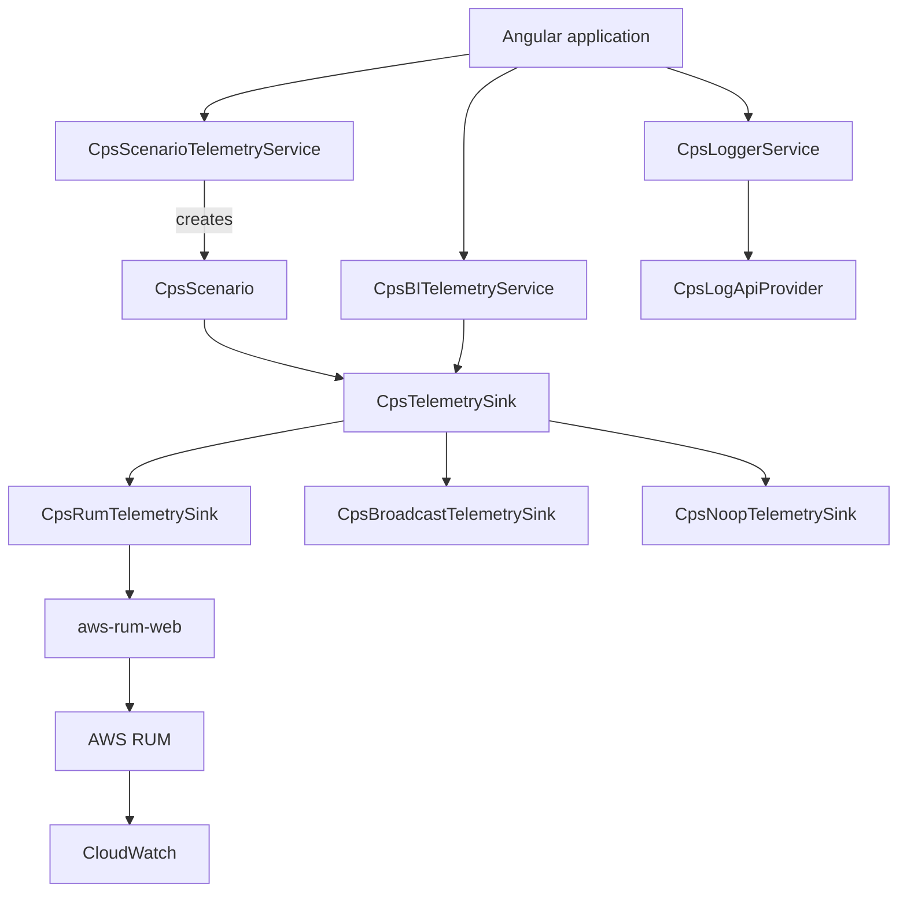
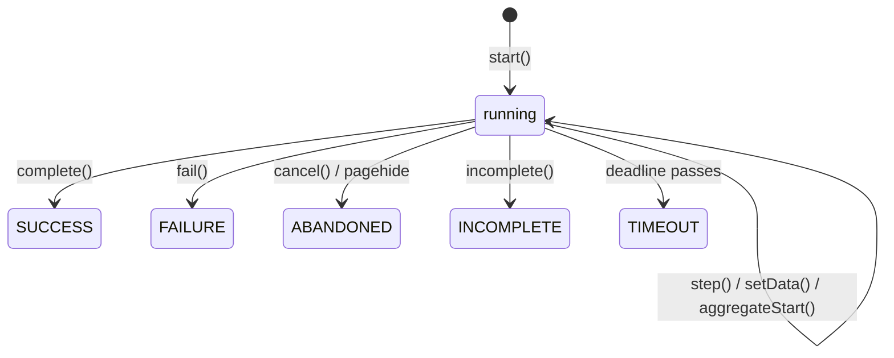
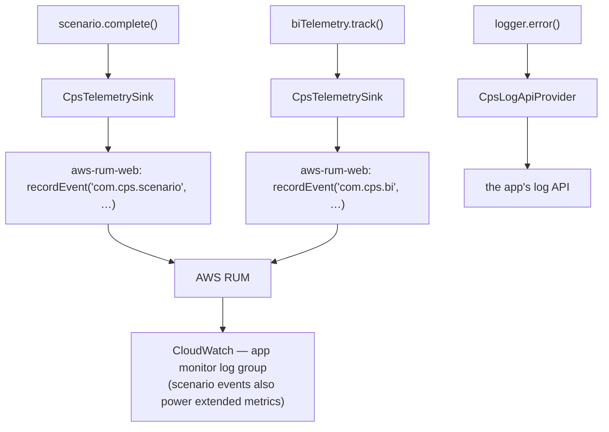
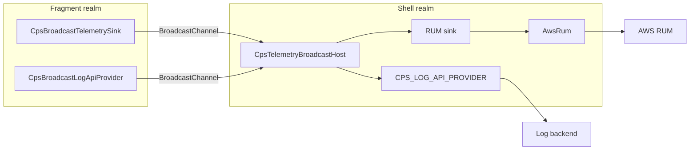

# cps-telemetry — development design

A reusable Angular telemetry layer covering three separate concerns —
application logs, scenario health telemetry, and business/UX events — built
on a shared internal abstraction, with an AWS CloudWatch RUM sink. Nothing in
it is tied to one application: the host app supplies its own event names,
configuration, log backend and AWS credentials.

---

## 1. Goals

- **Scenario health.** Measure whether a user journey (load customer data,
  open a report, submit a search, export data) succeeded, how long it took,
  and where the time went — so a regression shows up as a metric, not as a
  support ticket.
- **Correlated diagnostics.** When a journey fails, make it possible to pull
  the frontend logs, the frontend telemetry and the backend logs for _that
  one run_, using a single identifier.
- **Code-level diagnostics.** A scenario's status says a journey broke; logs
  say where in the code and why. Both carry the same `correlationId`, so
  together they read as one trail — from "what failed" to "what the code was
  doing when it did".
- **Product signal.** Record feature adoption and interaction events without
  putting business vocabulary inside the telemetry infrastructure itself.
- **Developer debugging.** Let any developer see exactly what telemetry is
  produced, in any environment, with a LocalStorage flag or an in-app popup —
  no rebuild, no config change, no production switch.
- **Reusability.** Ship as a library any Angular application can install and
  configure.
- **Safety.** Telemetry can never break the application, and it never quietly
  leaks sensitive data.

## 2. Non-goals

- Backend telemetry or log-ingestion APIs.
- CloudWatch infrastructure, dashboards, alarms or metric definitions.
- Lambda, API Gateway, IAM policies, CDK/Terraform.
- Backend log storage or retention policy.
- Session replay. RUM supports it; this library does not enable it.
- A general-purpose observability platform. This is a small library.

The backend RUM credential broker and the log store are assumed to exist. The
library defines the seams — `CpsRumCredentialsProvider` and
`CpsLogApiProvider` — and the consuming application implements them. Nothing
here mocks either one: a library that ships a fake backend is shipping a lie
about what it does.

---

## 3. Proposed architecture


```mermaid
flowchart TD
    A[Angular application]

    A --> B[CpsLoggerService]
    A --> C[CpsScenarioTelemetryService]
    A --> D[CpsBITelemetryService]

    C -->|creates| C2[CpsScenario]

    B --> E[CpsLogApiProvider]

    C2 --> G[CpsTelemetrySink]
    D --> G
    G --> G1[CpsRumTelemetrySink]
    G --> G2[CpsBroadcastTelemetrySink]
    G --> G3[CpsNoopTelemetrySink]

    G1 --> H[aws-rum-web]
    H --> I[AWS RUM]
    I --> J[CloudWatch]
```

| Component                     | Responsibility                                                                      |
| ----------------------------- | ----------------------------------------------------------------------------------- |
| `CpsLoggerService`            | Factory for named loggers, one per name, plus reading records back                  |
| `CpsScenarioTelemetryService` | Creates scenarios; settles any still running at page unload                         |
| `CpsScenario`                 | One independent journey — its steps, aggregates and outcome                         |
| `CpsBITelemetryService`       | Discrete business/UX events, deduplicated within a short window                     |
| `CpsTelemetrySink`            | Abstract destination for scenario and BI events                                     |
| `CpsRumTelemetrySink`         | The AWS RUM adapter — lazy SDK load, credentials, a pre-init buffer, flushing       |
| `CpsBroadcastTelemetrySink`   | Forwards a fragment's events to the shell                                           |
| `CpsNoopTelemetrySink`        | Explicit opt-out — everything runs, nothing ships                                   |
| `CpsLogApiProvider`           | The seam where the application supplies its log store — send, query, optional flush |
| `CpsRumCredentialsProvider`   | The seam where the application supplies its AWS details                             |
| `CpsTelemetryMonitor`         | A read-only stream of everything handed to a destination                            |

Everything is wired through Angular DI, so a destination can be swapped in
production and stubbed in tests.

### Entry points

Three, each pulling in only what it needs:

| Entry point                 | Contains                                    | Needs                                                                       |
| --------------------------- | ------------------------------------------- | --------------------------------------------------------------------------- |
| `cps-telemetry`             | Everything except the two below             | Angular                                                                     |
| `cps-telemetry/rum`         | `CpsRumTelemetrySink`, its providers        | `aws-rum-web`, an optional peer                                             |
| `cps-telemetry/diagnostics` | The [diagnostics popup](#diagnostics-popup) | `cps-ui-kit` (with `@angular/forms`, `@angular/animations`), optional peers |

A bundler resolves every static import in a module graph, and a dynamic
`import()`'s specifier, whether or not that code path ever runs. Keeping the
RUM sink and its `await import('aws-rum-web')` out of the main entry is what
lets an app using only `'broadcast'`/`'noop'` build without `aws-rum-web`
installed. The popup is split out the same way: it is the only UI in the
package, and nothing in the main entry — bundle or `.d.ts` — references
cps-ui-kit.

### Public API

Everything each entry point exports, by role.

**`cps-telemetry`**

| Role                        | Exports                                                                                                                                                                                                                                                                                                     |
| --------------------------- | ----------------------------------------------------------------------------------------------------------------------------------------------------------------------------------------------------------------------------------------------------------------------------------------------------------- |
| Setup                       | `provideCpsTelemetry`, `withLogging`, `withScenarios`, `withBIEvents`, `withRedaction`, `CpsTelemetryFeature`, `provideCpsTelemetrySink`, `CpsTelemetryLocalSinkMode` (`'broadcast' \| 'noop'`), `provideCpsTelemetryBroadcastHost`, `provideCpsTelemetryDestination` + `CpsTelemetryDestinationOptions`    |
| Configuration               | `CPS_TELEMETRY_IDENTITY` + `CpsTelemetryIdentity`; `CPS_LOG_CONFIG` + `CpsLogConfig`; `CPS_SCENARIO_TELEMETRY_CONFIG` + `CpsScenarioTelemetryConfig`; `CPS_BI_TELEMETRY_CONFIG` + `CpsBITelemetryConfig`; `CPS_REDACT_CONFIG`; `CPS_DEFAULT_TELEMETRY_CONFIG` (every default)                               |
| Scenarios                   | `CpsScenarioTelemetryService`, `CpsScenario`, `traceScenario` + `CpsTraceScenarioOptions`; models `CpsScenarioOptions`, `CpsScenarioOutcome`, `CpsScenarioStepDetail`, `CpsScenarioRecord`, `CpsScenarioStep`, `CpsScenarioStepEvent`, `CpsScenarioAggregate`, `CpsScenarioStatus`, `CpsScenarioStepStatus` |
| BI events                   | `CpsBITelemetryService`; `CpsBIEvent`, `CpsBIEventDetail` (`eventType` override, `scenarioId`, `feature`)                                                                                                                                                                                                   |
| Logging                     | `CpsLoggerService`, `CpsLogger`; `CpsLogDetail`, `CpsLogRecord`, `CpsLogLevel`, `CPS_LOG_LEVEL_ORDER`; `CPS_LOG_API_PROVIDER`, `CpsLogApiProvider`, `CpsLogQuery`; `CpsNoopLogApiProvider`, `CpsBroadcastLogApiProvider`                                                                                    |
| Name registries             | `CpsScenarioNames` / `CpsScenarioName`, `CpsScenarioSteps` / `CpsStepName`, `CpsBIEventNames` / `CpsBIEventName`, `CpsLoggerNames` / `CpsLoggerName`                                                                                                                                                        |
| Sinks                       | `CpsTelemetrySink` (abstract), `CpsNoopTelemetrySink`, `CpsBroadcastTelemetrySink`, `CpsTelemetryBroadcastHost`, `CPS_BROADCAST_CHANNEL`, `CPS_DEFAULT_BROADCAST_CHANNEL` (`'cps-telemetry'`); `cpsClassifyTelemetryEvent` + `CpsTelemetrySinkEvent`, for a sink to tell what it received                   |
| Shared models               | `CpsTelemetryMetadata`, `CpsTelemetryError`, `CpsTelemetryAttribution`; event types `CPS_DEFAULT_EVENT_NAMESPACE`, `CPS_TELEMETRY_EVENT_TYPE`, `cpsEventTypes()`, `CpsTelemetryEventTypes`                                                                                                                  |
| Monitor                     | `CpsTelemetryMonitor`; `CpsTelemetryObservedEvent`, `CpsTelemetryPublishInput`, `CpsTelemetryEventKind`, `CpsTelemetryDestination`, `CpsTelemetryEventOrigin`, `CpsJsonValue`, `CpsJsonObject`                                                                                                              |
| Redaction, for custom sinks | `cpsRedactMetadata`, `cpsNormalizeError`, `cpsScrubString`, `cpsRedactConfigFor`, `CpsRedactConfig`, `CPS_DEFAULT_REDACT_CONFIG`, `CpsPiiValuePattern`, `CPS_REDACTED` (`'[redacted]'`, the replacement value)                                                                                              |
| Utilities                   | `cpsUuid()`, `cpsIsDebugEnabled(flag, name?)` + `CpsDebugFlag` (`'debugLogger' \| 'debugScenario' \| 'debugBI'`)                                                                                                                                                                                            |

**`cps-telemetry/rum`:** `provideCpsTelemetryRumSink`, `CpsRumTelemetrySink`,
`CPS_RUM_CREDENTIALS_PROVIDER`, `CpsRumCredentialsProvider`,
`CpsRumBootstrap` (`{ config, credentials? }`), `CpsRumAppMonitorConfig`,
`CpsRumCredentials` (`accessKeyId`, `secretAccessKey`, `sessionToken`,
`expiration`).

**`cps-telemetry/diagnostics`:** `provideCpsTelemetryDiagnostics`,
`CpsTelemetryDiagnosticsService`, `CPS_TELEMETRY_DIAGNOSTICS_CONFIG`,
`CpsTelemetryDiagnosticsConfig`, `CPS_DEFAULT_DIAGNOSTICS_CONFIG`,
`CpsDiagnosticsShortcut`, `CPS_DEFAULT_DIAGNOSTICS_SHORTCUTS`,
`CpsDiagnosticsExport`, `CpsDiagnosticsSectionId`, and the filter types
`CpsDiagnosticsFilterState`, `CpsDiagnosticsFieldFilter`,
`CpsDiagnosticsFilterOperator` — see §12, "Diagnostics popup".

### Destinations

A realm has exactly **one telemetry destination**: the sink every scenario
record, BI event and mirrored error is handed to. RUM is one destination
among several — `'broadcast'` and `'noop'` are others, and any class that
extends `CpsTelemetrySink` can be one. Changing the backend is swapping that
one sink; application code — the services, the loggers, the scenario calls —
never refers to a destination and doesn't change.

**Registering one.** Every destination, the library's own included, is
registered with `provideCpsTelemetryDestination(SinkClass, { init? })`. It
binds `CpsTelemetrySink` to the class and runs the optional `init` once at
startup from an app initializer, unawaited — the RUM sink uses it to load
credentials. `provideCpsTelemetryRumSink()` and
`provideCpsTelemetrySink('broadcast' | 'noop')` are this call with a class
filled in.

**Exactly one.** Two different destinations fail bootstrap —
`[cps-telemetry] More than one telemetry destination is provided: …
Provide exactly one.` — instead of silently keeping whichever was listed
last. Listing the same one twice is fine, and starts it once. A sink bound
directly (`{ provide: CpsTelemetrySink, useClass: … }`, as tests do) bypasses
the helper and the check. No destination at all still fails with `NG0201`.

**Writing one.** A destination implements the six methods of
`CpsTelemetrySink`:

| Method                                  | Receives                                                                                                          |
| --------------------------------------- | ----------------------------------------------------------------------------------------------------------------- |
| `record(eventType, payload, metadata?)` | Every scenario record, step event (with `emitLifecycleEvents`) and BI event, plus events forwarded from fragments |
| `recordError(error, metadata?)`         | Errors mirrored from `logger.error` (`mirrorErrorsToRum`), and those forwarded from fragments                     |
| `getSessionId()`                        | Asked for the session id stamped on records and log lines — the destination owns it, or returns `undefined`       |
| `setUserId(userId)` / `getUserId()`     | Sign-in and sign-out (`undefined` or `''`) — the destination owns attribution                                     |
| `flush(beacon?)`                        | `pagehide` (with `beacon`), `visibilitychange` to hidden, and teardown                                            |

`cpsClassifyTelemetryEvent(eventType, payload)` tells `record` what it got,
as a discriminated union — `scenario` (a `CpsScenarioRecord`),
`scenario-step` (a `CpsScenarioStepEvent`), `bi` (a `CpsBIEvent`) or
`unknown` (an event-type override). It matches on the event type's ending,
so it works for any `eventNamespace` and for forwarded events; the broadcast
host uses it too.

What a destination does **not** need to do: redact (payloads arrive already
redacted), deduplicate BI events, time anything, or guard the library's
calls — every call the library makes into it, `init` included, is wrapped
fail-open. The one exception is `setUserId`/`getUserId`, which the
application calls on the sink directly; a destination should not throw
there. The
diagnostics monitor observes the hand-off, so the popup works with any
destination. Log lines are not part of it: they go to the application's
own log backend through `CPS_LOG_API_PROVIDER`, whatever the destination.

```ts
providers: [
  provideCpsTelemetry({ application: 'my-app', environment, version }),
  provideCpsTelemetryDestination(MyBackendSink, { init: (s) => s.start() }),
  { provide: CPS_LOG_API_PROVIDER, useExisting: MyLogBackend }
];
```

### The telemetry monitor

Every place that hands something to a destination — the scenario's emit,
`track()`, the logger's delivery and its RUM mirror, and the broadcast host
forwarding a fragment's events and logs — then publishes the same object to
`CpsTelemetryMonitor`, inside the same fail-open block. So nothing is sent
twice, and a hand-off that throws is not shown. A fragment's event appears
once in each popup: as its own in the fragment's, as forwarded in the
shell's.

### Packaging and internals

- **Every export is explicit.** The barrels list their exports one by one —
  in a published package each exported name is a compatibility promise. Id
  generation, the clock, the fail-open wrappers, User Timings and the
  broadcast plumbing stay internal so they can change freely. Redaction is
  the exception: a custom sink needs `cpsRedactMetadata`,
  `cpsNormalizeError`, `cpsScrubString` and `cpsRedactConfigFor`.
- **Secondary entries keep private copies of a few utilities.** ng-packagr
  fixes each entry point's `rootDir` to its own `src`, so
  `cps-telemetry/rum` and `cps-telemetry/diagnostics` can't import the main
  entry's internals by relative path and carry small copies of what they
  need.
- **cps-ui-kit is resolved from its build.** The package build maps
  `cps-ui-kit` to `dist/cps-ui-kit` (a `paths` entry in `tsconfig.lib.json`),
  so the kit stays an external dependency rather than being compiled in —
  which is why `npm run build:telemetry` builds cps-ui-kit first. The app and
  unit tests resolve both libraries from source.
- **Test doubles live in the specs that use them**, declared inline, never in
  a shared file and never exported. The one browser gap needing a stub is
  `BroadcastChannel`, which jsdom doesn't implement.

---

## 4. Data model

Every record a concern emits, and why each field is (or is not) there.

### Log record

```ts
interface CpsLogRecord {
  timestamp: string; // ISO-8601
  level: 'log' | 'warn' | 'error';
  message: string; // scrubbed, length-capped
  logger?: CpsLoggerName; // which part of the app wrote it — always set
  context?: string; // free-form subsystem label
  metadata?: CpsTelemetryMetadata;
  error?: CpsTelemetryError;
  correlationId?: string; // usually a scenarioId
  application: string;
  environment: string;
  version: string;
  userId?: string;
  sessionId?: string; // from the sink, so logs join the RUM stream
}
```

Logs carry `sessionId`/`userId` themselves because they go to your own
backend, with no RUM envelope to inherit them from.

### The name vocabulary

Scenario and step names are **metric dimensions**, not free text, so they are
a finite type. Declare your application's names once in a schema file:

```ts
// src/app/telemetry.schema.ts
declare module 'cps-telemetry' {
  interface CpsScenarioNames {
    'load-customer-data': true;
  }

  interface CpsScenarioSteps {
    'fetch-data': true;
    render: true;
  }
}

export {};
```

Import that file once — anywhere in the compilation — and every name gets
checked from then on:

```ts
scenario.step('fetch-data'); // ok
scenario.step('fetch-dat'); // error TS2345
```

A typo here would not just produce a wrong number. It would silently start a
**second, incomplete** metric series, and the alarm built on the first one
would keep reading healthy. Interpolating an id — ``step(`load-${id}`)`` —
does the same at a larger scale. The type turns both into compile errors.

Both registries start empty, and `CpsScenarioName` / `CpsStepName` fall back
to `string` until the first augmentation (`keyof` an empty interface is
`never`, which would make every call uncallable). Adoption is therefore
incremental. `CpsScenarioSteps` also covers `aggregateStart` /
`aggregateEnd`, since they name the same kind of thing as a step.

#### BI event names

Event names are metric dimensions too, so they are a closed vocabulary in the
same way scenario and step names are:

```ts
// src/app/telemetry.schema.ts
declare module 'cps-telemetry' {
  interface CpsBIEventNames {
    export_clicked: true;
    theme_changed: true;
  }
}
export {};
```

```ts
biTelemetry.track('export_clickd'); // error TS2345
```

`CpsBIEventName` falls back to `string` until the registry is augmented. If
you wrap `track()` in your own service, type the wrapper's parameter as
`CpsBIEventName` — a plain `string` stops being assignable once you declare a
vocabulary.

#### Logger names

Declare a logger per area of the application:

```ts
// src/app/telemetry.schema.ts
declare module 'cps-telemetry' {
  interface CpsLoggerNames {
    checkout: true;
    admin: true;
  }
}

export {};
```

The name lands on `record.logger`. It is separate from `context`, which stays
free text: `logger` says _where the record came from_, `context` says _what
it is about_, and only the first is routed on. A typo in a logger name would
send a whole stream to the wrong place, which is why it is checked.

**The name is identity.** `CpsLoggerService` is a factory, not a logger: it
exposes `getLogger(name)` and `query()`, and nothing that writes. Asking for
the same name twice returns the same logger, the way a file name always
refers to one file, and the logger captures its name once — no call can
restate or contradict it. Four things key off it, and an unnamed record would
be reachable by none of them:

| Capability                    | Resolves through                       |
| ----------------------------- | -------------------------------------- |
| Per-logger severity floors    | `levels?.[logger] ?? minLevel`         |
| Name-scoped console filtering | the `debugLogger` flag's list of names |
| Reading records back by area  | `query({ logger })`                    |
| Attributing a console line    | the `[app][logger]` prefix             |

An unnamed call would read identically, compile and ship, and only reveal
itself when turning a noisy area down did nothing — so the API offers no
unnamed path at all.

The library never writes any log lines of its own, so `CpsLoggerName` is
exactly whatever the application declares — there are no reserved names to
work around.

### Scenario

A scenario emits **one** event, when it settles, with its steps packed
inside — see [the session event budget](#the-session-event-budget) for why.

```ts
interface CpsScenarioRecord {
  scenarioId: string; // uuid — the correlation id
  parentScenarioId?: string;
  scenarioName: CpsScenarioName;
  feature?: string;
  operation?: string;
  route?: string; // a route template, never a resolved path
  status?: CpsScenarioStatus; // undefined only on a mid-flight toRecord()
  statusCode?: string | number; // HTTP status or business code
  message?: string;
  reason?: string; // structured, low-cardinality
  error?: CpsTelemetryError;
  startTime: string; // ISO-8601
  endTime?: string; // ISO-8601
  delta: number; // ms — total duration, the headline latency measure
  elapsed: number; // ms since the host page loaded — a timeline position
  stepCount: number;
  steps: CpsScenarioStep[];
  exceededStepsLimit?: boolean; // steps[] truncated at maxSteps
  previousStep?: CpsStepName; // last real step closed before settling
  aggregates?: CpsScenarioAggregate[];
  metadata?: CpsTelemetryMetadata;
  application: string;
  sessionId?: string;
  userId?: string;
}

interface CpsScenarioStep {
  name: CpsStepName | 'scenario-start' | 'scenario-end';
  startOffset: number; // ms from the scenario's start
  endOffset?: number;
  stepDelta?: number; // this step's own duration
  elapsed?: number; // ms since the host page loaded, at step close
  status?: CpsScenarioStepStatus;
  message?: string;
  reason?: string;
  error?: CpsTelemetryError;
  metadata?: CpsTelemetryMetadata;
}

interface CpsScenarioAggregate {
  name: CpsStepName; // shares the step vocabulary
  elapsed: number; // summed across every call
  callCount: number;
}
```

- **Durations and positions have different names.** `delta` (and a step's
  `stepDelta`) is how long something took; `elapsed` is _when_ it happened,
  in ms since the host page loaded, so events from one session can be lined
  up against each other. `endTime` is not a second duration — it is
  `startTime + delta`, there to place a journey on the wall clock. `elapsed`
  is inexact across a hard reload, since the RUM session cookie
  (`allowCookies` on by default, 30-minute default session length) survives a
  reload that resets `performance.timeOrigin`, so one `sessionId` can span an
  `elapsed` reset.
- **Step offsets are relative** to the scenario's own start, so they stay
  small integers inside the payload.
- **A settled record has at least two steps.** Two zero-duration markers
  bookend the real ones: `scenario-start`, written at start, and
  `scenario-end`, written at settlement with the scenario's status and
  settle-time detail. Reading `steps[]` alone tells the full story. Neither
  counts toward `stepCount` or `maxSteps`, and they need no registration.
  A mid-flight `toRecord()` snapshot can hold just `scenario-start`.
- **`application`, `sessionId` and `userId` are on the record**, even though
  RUM also attaches session and user ids to each request envelope. A payload
  that makes you cross-reference the envelope to answer "who, which session,
  which app" is worse to work with in a Logs Insights query or any consumer
  that only sees the payload; the extra bytes are worth it. `sessionId` is
  absent until the RUM client initializes, `userId` until someone signs in.

**Once a scenario settles, `steps` has at least two entries.** Two
zero-duration markers bookend whatever real steps the caller declared:
`scenario-start`, written in the constructor, and `scenario-end`, written at
settlement, carrying the scenario's own final status plus whichever of
`message`/`metadata`/`error` the settle-time `CpsScenarioOutcome` supplied.
That is the same detail that also closes whatever real step was still open,
and that lands on the record's own root fields. All three views agree with
each other, so reading `steps[]` alone tells the full story without
cross-referencing the root record. A scenario that never calls `.step()`
still gets exactly the two boundary markers once it settles. Neither counts
toward `stepCount`, `exceededStepsLimit` or `maxSteps` — that budget is only
about steps the caller actually opened. The type allows the two literal
names alongside `CpsStepName` rather than requiring every consuming
application to register them, because they are the library's own to write,
not the application's to declare.

`scenario-end` is only written at settlement, so this two-entry minimum is a
property of a _settled_ record, not a guaranteed one: `toRecord()` is public
and safe to call on a still-running scenario, and a snapshot taken before
the first `.step()` call — before `scenario-end` exists — can have as few as
one entry (just `scenario-start`).

**`application`, `sessionId` and `userId` are on this record.** The
alternative — relying on the fact that AWS's own `Dispatch.js` already
attaches `UserDetails: { userId, sessionId }` to _every_ `PutRumEvents`
request, so leaving them off the payload body would save real bytes against
the 200-event session cap — is a real saving, but it loses to a bigger cost:
a payload that makes you cross-reference the outer request envelope just to
answer "who did this, which session, which app" is a worse experience when
you are reading the record directly, whether in a Logs Insights query against
the event body or in any consumer that only ever sees the payload.
Consequently, the extra bytes win. `sessionId` and `userId` stay optional at the type level:
`sessionId` genuinely is not there before the RUM client finishes
initializing, and `userId` only exists once someone has signed in.

With `emitLifecycleEvents: true`, each closed step is also sent on its own
as `{ns}.scenario.step` — a `CpsScenarioStepEvent`, which is the step plus
the record's `scenarioId`, `scenarioName`, `application`, `sessionId` and
`userId`.

### BI event

```ts
interface CpsBIEvent {
  eventName: CpsBIEventName;
  eventTime: string;
  scenarioId?: string;
  feature?: string;
  metadata?: CpsTelemetryMetadata;
  application: string;
}
```

There is no `route` — the RUM envelope's page id already carries the page —
and no `sessionId`/`userId`, which RUM attaches once per session.

#### One event type

All BI events share a single event type, with `eventName` carried as a field
— one schema to query, one extended-metric definition. If an existing
dashboard is keyed on a specific legacy type, a single event can override it:

```ts
biTelemetry.track(
  'click',
  { source: 'toolbar' },
  { eventType: 'com.my-app.click' }
);
```

Use that only for migration — giving every event its own type is exactly what
the single-type design avoids.

### Fields deliberately left out

| Not collected                      | Why                                                                                                                         |
| ---------------------------------- | --------------------------------------------------------------------------------------------------------------------------- |
| `device`, `browser`, `page`        | RUM attaches browser, OS, device type, page URL and id, country and referrer to every event                                 |
| `environment`, `version` on events | Attached once per session through session attributes                                                                        |
| `networkType`                      | The Network Information API is Chromium-only and coarse — a metric nobody can trust across browsers is worse than none      |
| `timeToStart`                      | RUM's navigation timing already answers it                                                                                  |
| A separate `latency`               | That is `delta` for a scenario and `stepDelta` for a step; a third name for the same number invites inconsistent dashboards |
| A retry counter                    | A retry is a step like any other; `stepCount` and repeated step names carry the signal                                      |
| `spanId`                           | Would only help if something threaded it into an X-Ray header, and nothing does                                             |

---

## 5. Lifecycle

A scenario is one user journey — load customer data, open a report, submit a
search. Any number can run at once, and each is fully independent.


```mermaid
stateDiagram-v2
    [*] --> running: start()
    running --> running: step() / setData() / aggregateStart()
    running --> SUCCESS: complete()
    running --> FAILURE: fail()
    running --> ABANDONED: cancel() / pagehide
    running --> INCOMPLETE: incomplete()
    running --> TIMEOUT: deadline passes
```

There are five statuses and no "in progress" one. `scenario.status` stays
`undefined` until it settles, `scenario.isSettled` is derived from it, and
nothing is emitted before settlement — a running scenario has nothing to
report yet. Four of the five are unsuccessful on purpose, because each
demands a different response; folding them together would make the failure
rate useless for alerting:

| Status       | Meaning                                                                               | Response                                     |
| ------------ | ------------------------------------------------------------------------------------- | -------------------------------------------- |
| `success`    | The journey reached its goal                                                          | —                                            |
| `failure`    | A defect — the journey broke                                                          | Investigate; page someone if the rate spikes |
| `abandoned`  | It stopped mattering: the user navigated away, or the page unloaded                   | Engagement signal, not a defect              |
| `incomplete` | An expected path that missed the goal — no results, a guard declined, a flag rerouted | Product signal, not an engineering one       |
| `timeout`    | It never settled within its deadline                                                  | Engagement signal, distinct from an abandon  |

`metadata.abandonedBy` records which kind of abandonment it was — `'caller'`
for `cancel()`, `'page-hidden'` for an unload. `timeout` is its own status
rather than a third cause under `abandoned`, so it can be filtered and
alerted on directly.

```ts
const rows = await this.api.search(term);
if (!rows.length) {
  scenario.incomplete({ reason: 'no-results' }); // not a failure
  return;
}
```

- **Terminal states stay terminal.** Calling a settle method on a settled
  scenario is a silent no-op, never a throw. A `catch` that calls `fail()`
  and a `finally` that calls `complete()` record the failure, not the last
  call.
- **Timeout.** A scenario that never settles would silently vanish,
  inflating the success rate. Each carries a timer — 30s by default,
  `timeoutMs` per scenario, `0` to disable — that settles it as `timeout`.
  The timer is scheduled outside Angular's zone, so a running scenario never
  holds the application unstable (`whenStable`, hydration,
  `registerWhenStable`) for the length of its timeout.
- **Unload.** On `pagehide`, every running scenario settles as `abandoned`
  (`page-hidden`) and the sink is flushed with a beacon. Emission is
  synchronous, so everything settled here reaches the sink first.
- **Going hidden.** Mobile browsers often kill a backgrounded tab without a
  `pagehide`, so on `visibilitychange` to `hidden` the sink is flushed too —
  but scenarios keep running, since the user may come back.
- **No pause/resume.** Nothing here needs a scenario that spans app
  backgrounding, and pause handling would touch every timing path.

### Settling from a status you were handed

In application code, call `complete()` / `fail()` / `cancel()` /
`incomplete()` directly. Naming the outcome at the call site is what lets
someone find every place a journey can fail by searching for `.fail(`.

`settle()` exists for adapters — places where the outcome genuinely arrives
as data:

```ts
const outcomeFor: Record<JobState, CpsScenarioStatus> = {
  ok: 'success',
  error: 'failure',
  superseded: 'abandoned'
};

jobUpdates.subscribe((update) =>
  this.scenarios.get(update.id)?.settle(outcomeFor[update.state])
);
```

If you reach for `settle()` inside a feature, the outcome was probably known
all along — use the named method instead.

### RxJS streams and `traceScenario`

For Observable-driven journeys, the pipeable `traceScenario` operator
completes or fails the scenario based on how the stream ends. If it is torn
down some other way first — a superseding `switchMap`, `takeUntilDestroyed()`,
a manual unsubscribe — it cancels the scenario instead of leaving it to
settle as a `timeout`.

```ts
import { traceScenario } from 'cps-telemetry';

this.api
  .fetchCustomers()
  .pipe(
    traceScenario(scenario, (rows) => ({
      metadata: { rowCount: rows.length }
    }))
  )
  .subscribe();
```

That cancellation carries no `reason` unless you supply `cancelOutcome`. For
a `switchMap`-superseded scenario it is the only way to label it: calling
`scenario.cancel({ reason: 'superseded' })` from the next value's projector
does nothing, because `switchMap` has already unsubscribed — and so settled —
the previous scenario before that projector runs.

```ts
this.searchSubject$.pipe(
  switchMap((query) => {
    const scenario = this.scenarioTelemetry.start({ name: 'search' });
    return this.api
      .search(query)
      .pipe(
        traceScenario(scenario, { cancelOutcome: { reason: 'superseded' } })
      );
  })
);
```

How it decides: `traceScenario` settles on `complete` with optional derived
outcome metadata, and fails with the caught error on `error`. A teardown that reaches neither — a superseding `switchMap`, `takeUntilDestroyed()`,
a manual unsubscribe — cancels the scenario instead, guarded by `isSettled`
so it never re-cancels one that already completed or failed (`tap`'s own
`unsubscribe` hook fires after every teardown, settled or not). Without
this, a cancelled-by-unsubscription scenario would sit active until its own
timeout and record as `timeout` rather than the caller-driven abandonment
it actually was.

### Measuring what the user waited for

`complete()` stops the clock the moment the JavaScript finishes. For a
journey that ends in a render, the user is often still looking at the old
screen at that moment.

The library does not settle scenarios on paint: how long to wait, and what to
do if nothing paints, is a decision with no single right answer. For a rough
measure, two animation frames is a one-liner:

```ts
scenario.step('render');
this.rows.set(rows);
requestAnimationFrame(() => requestAnimationFrame(() => scenario.complete()));
```

That only proves a frame boundary passed. To measure the real paint, mark the
element with an `elementtiming` attribute and observe `element` entries with
a `PerformanceObserver` — pass `buffered: true`, since the paint usually
happens before the observer starts, and check
`PerformanceObserver.supportedEntryTypes` first: Element Timing is
Chromium-only, so most sessions still need a fallback.

If nothing ever paints — a backgrounded tab, a stalled render — the
scenario's own timeout settles it as `timeout`. That is the honest outcome:
the user never saw the result.

A `completeOnNextPaint()` convenience method — one that resolves three ways
and records which one fired — is not offered, because two of the three
outcomes would be wrong in exactly the way that matters. A paint that never
happens would have to settle as **success** to fit that shape, inflating the
success rate exactly when rendering is worst. An observed-paint path, in turn, can
only timestamp the callback rather than the paint itself, so even the one
accurate route would still be inflated by dispatch latency. The reference implementation's
`stopAtNextFrame` gets both right — it cancels on timeout and backdates via
`overrideTimestamp` — but reproducing that faithfully would be more
machinery than the convenience is worth.

### Backdating

A journey usually starts before the code measuring it runs. Record the real
starting point, in epoch milliseconds, and pass it as `startedAt`:

```ts
onClick() { this.clickedAt = Date.now(); }

// later, in the async handler
scenarioTelemetry.start({ name: 'export', startedAt: this.clickedAt });
```

It is clamped to the page's lifetime; an unusable value falls back to now
rather than producing a negative duration.

### Concurrency and inspecting what's active

Concurrency is per instance, not per name. Any number of scenarios can share
a `name` and run at once — a name is a metric dimension, not a lock. Two
tabs, two dashboard panels or two rows edited independently are legitimately
concurrent, and the library cannot tell them apart from a caller starting
the same action twice; guessing wrong either way would be worse than not
guessing. Instead, it lets you look:

```ts
scenarioTelemetry.find(scenarioId); // one scenario, by id
scenarioTelemetry.findByName('load-widget'); // every active scenario with that name
scenarioTelemetry.findByNameAndId('load-widget', scenarioId); // an id lookup, asserting the name
scenarioTelemetry.getActive(); // everything in flight, in start order
```

When you know two calls are the same logical action — a search box
re-querying, a table page reloading — track that scenario and cancel it
before starting the next, as in the `switchMap` + `cancelOutcome` pattern
above.

In development, the service warns each time a scenario starts while more
than 50 are already active — usually a sign of scenarios with `timeoutMs: 0`
forgotten by a component lifecycle bug, which otherwise stay in memory until
the page unloads.

---

## 6. AWS mapping

How each concern reaches AWS, and the SDK facts that shaped it.


```mermaid
flowchart TD
  A1["scenario.complete()"] --> S1["CpsTelemetrySink"]
  A2["logger.error()"] --> S2["CpsLogApiProvider"]
  A3["biTelemetry.track()"] --> S3["CpsTelemetrySink"]

  S1 --> R1["aws-rum-web: recordEvent('com.cps.scenario', …)"]
  S3 --> R2["aws-rum-web: recordEvent('com.cps.bi', …)"]

  R1 --> RUM["AWS RUM"]
  R2 --> RUM
  S2 --> LOGAPI["the app's log API"]

  RUM --> CW["CloudWatch — app monitor log group<br/>(scenario events also power extended metrics)"]
```

### Event types

One event type per concern, with whatever varies carried as data:

| Type                 | When                                                               |
| -------------------- | ------------------------------------------------------------------ |
| `{ns}.scenario`      | Once per scenario, at settlement (`status` distinguishes outcomes) |
| `{ns}.scenario.step` | Per step — only with `emitLifecycleEvents`                         |
| `{ns}.bi`            | Per business/UX event (`eventName` carries the vocabulary)         |

`{ns}` is `eventNamespace`, `com.cps` by default
(`CPS_DEFAULT_EVENT_NAMESPACE`; a custom sink can derive the same strings
with `cpsEventTypes()`). It is configurable because **event types are a
contract with whatever already queries them** — extended metrics, Logs
Insights queries, dashboards. Distinct types per transition
(`scenario_completed`, …) would multiply the schemas to query and the metric
definitions to maintain, where a `status` dimension does the same job.

The `aws:` metadata prefix is reserved — the client drops such keys with a
warning — so the sink filters them out before recording.

### The session event budget

AWS RUM's defaults shape the whole design:

```
sessionEventLimit: 200   <-- hard cap on events per session
eventCacheSize:   1000
batchLimit:        100
dispatchInterval: 5000ms
sessionSampleRate:   1
```

**200 events per session, across all telemetry** — page views, web vitals
and JS errors included. So **a scenario emits exactly one event, at
settlement**, with its steps packed into the payload: a six-step scenario
costs 1 of the 200. With `emitLifecycleEvents: true` it costs 7 (one per step
plus the record), and roughly thirty such scenarios exhaust the budget, after
which everything else — errors included — is dropped. Lifecycle events are
meant for local debugging. All five limits are configurable on
`CpsRumAppMonitorConfig`; raising `sessionEventLimit` moves the ceiling but
doesn't change the packed default.

### What the SDK can and cannot do

Checked against `aws-rum-web@3.2.1` as installed in this repository — not
against documentation.

| Capability                              | Verdict                                                                                                                                                           | Evidence                                                     |
| --------------------------------------- | ----------------------------------------------------------------------------------------------------------------------------------------------------------------- | ------------------------------------------------------------ |
| Custom events                           | ✅ `recordEvent(eventType, eventData, metadata?)`                                                                                                                 | `@aws-rum/web-slim/dist/es/orchestration/Orchestration.d.ts` |
| Custom event attributes                 | ✅ third `metadata` argument, `Record<string, string \| number \| boolean>`                                                                                       | `@aws-rum/web-core/dist/es/plugins/types.d.ts`               |
| Global event decoration                 | ✅ `setEventMetadataHook()` / `clearEventMetadataHook()`                                                                                                          | same                                                         |
| Session attributes                      | ✅ `addSessionAttributes()`                                                                                                                                       | same                                                         |
| Session identification                  | ✅ `getSessionId()`, `pinSessionId()`, `startSession()`                                                                                                           | same                                                         |
| User identification                     | ✅ `getUserId()`, `pinUserId()`                                                                                                                                   | same                                                         |
| Page / action tracking                  | ✅ `recordPageView()`, `registerDomEvents()`                                                                                                                      | same                                                         |
| Errors                                  | ✅ `recordError()`                                                                                                                                                | same                                                         |
| Performance measurements                | ✅ via built-in `performance` telemetry + Web Vitals plugin                                                                                                       | `WebVitalsPlugin`, `NavigationPlugin`, `ResourcePlugin`      |
| Flushing / buffering                    | ✅ `dispatch()`, `dispatchBeacon()`; `dispatchInterval` 5s, `batchLimit` 100 by default, both configurable via `CpsRumAppMonitorConfig`                           | `Orchestration.js` defaults                                  |
| Custom **metrics**                      | ❌ **not an SDK concept.** Emit events; define CloudWatch RUM _extended metrics_ server-side                                                                      |
| Correlation identifiers                 | ⚠️ **no built-in scenario correlation.** X-Ray trace ids exist for HTTP; journey correlation is ours to design                                                    |
| Reading telemetry back from the browser | ❌ no export/read API                                                                                                                                             |
| Offline behaviour                       | ⚠️ events sit in the in-memory cache (`eventCacheSize` 1000 by default, configurable) and are lost on tab close; there is no persistent queue                     |
| Web Worker execution                    | ❌ **not possible** — `SessionManager` reads `window.location.hostname`, `document.cookie` and `navigator.cookieEnabled`, none of which exist in a worker context |

### Which signals come from where

| Layer                  | Answers                                                                  | Source                                                                   |
| ---------------------- | ------------------------------------------------------------------------ | ------------------------------------------------------------------------ |
| **RUM built-in**       | Is the app fast? Is it erroring? Who uses it?                            | Page views, navigation timing, Web Vitals, JS and HTTP errors, resources |
| **Scenario telemetry** | Does _this journey_ work, how long does it take, where does the time go? | `{ns}.scenario`                                                          |
| **BI telemetry**       | Is the feature used, by how many people, in what order?                  | `{ns}.bi`                                                                |
| **Application logs**   | What exactly happened during this one run?                               | `CpsLoggerService` → your `CpsLogApiProvider`                            |

The custom layers duplicate nothing built in: the library records no page
views, does not re-capture unhandled errors, and collects no browser or
device attributes.

### From events to metrics

- **Custom RUM events don't become CloudWatch metrics on their own.** They
  land in the app monitor's log group; a metric needs a server-side RUM
  _extended metric_. The frontend's job is to emit low-cardinality
  dimensions (`scenarioName`, `status`, `feature`, `operation`) and values
  (`delta`, `stepCount`).
- **Percentiles are computed by AWS**, never in the browser — a Logs Insights
  `stats pct(delta, 95) by scenarioName`, or a percentile statistic on an
  extended metric. One client sees too few samples, so the frontend ships
  raw `delta` values.
- **CloudWatch Logs and RUM are separate streams**, joined analytically on
  `sessionId` and `scenarioId`.

---

## 7. Metrics enabled

**Reliability**, from `status` over `{ns}.scenario`, grouped by
`scenarioName`: success, failure, abandonment, timeout and incomplete rates,
and the error-category distribution by `statusCode` and `error.name`. Keeping
the statuses apart is what makes the failure rate usable for alerting.

**Latency:** total duration (`delta`), with P50–P99 computed AWS-side. A
journey that settles on an observed paint measures what the user waited for;
mark such scenarios in their `metadata` to separate them.

**Within-journey latency is payload, not a metric.** `steps[].stepDelta`,
`aggregates[].elapsed` and `callCount` answer "where did the time go" in a
Logs Insights query, but can't drive a metric while scenarios are packed — a
metric takes one value per event, and a step array holds many. For
step-level metrics, either turn on `emitLifecycleEvents` and pay the budget,
or keep packed emission and treat step timings as a troubleshooting tool.
`previousStep` (where journeys stop) and `exceededStepsLimit` (a truncated
step list, not a short journey) answer the two most common step questions
without unpacking anything.

**Usage:** scenario counts by `status` over time, unique users (RUM's own
`userId`), and feature adoption from `{ns}.bi` counts by `eventName` and
`feature`.

### Additional signals evaluated

| Signal                                     | Kept?                          | Reasoning                                                                                                                                                                                                                        |
| ------------------------------------------ | ------------------------------ | -------------------------------------------------------------------------------------------------------------------------------------------------------------------------------------------------------------------------------- |
| retry count                                | ❌                             | Evaluated and not collected. A retry is a step like any other, so `stepCount` and repeated step names already carry the signal; a dedicated counter would mean adding a `retry()` method this design has no other reason to want |
| number of steps                            | ✅ `stepCount`                 | Detects runaway loops and identifies which code path ran                                                                                                                                                                         |
| success-after-retry                        | ❌                             | Follows retry count out: without a counter there is nothing to derive it from                                                                                                                                                    |
| slow-step rate                             | ⚠️ derived, verbose only       | Thresholding step `stepDelta` needs one event per step, so it is only a metric under `emitLifecycleEvents`; packed, it is a Logs Insights query                                                                                  |
| error-category distribution                | ✅ `statusCode` + `error.name` | Separates "backend 500" from "client-side type error"                                                                                                                                                                            |
| client/application version                 | ✅ session attribute           | Attributes a regression to a release                                                                                                                                                                                             |
| network/API dependency failures            | ✅                             | Already covered by RUM's built-in HTTP telemetry — not duplicated                                                                                                                                                                |
| scenario version / feature version         | ❌                             | Folded into `feature` plus the application version; separate version fields on every event would be payload with no distinct question behind them                                                                                |
| time spent per step (as a separate metric) | ❌                             | That _is_ `steps[].stepDelta` — carried on the record, queryable, but not a dashboard metric while packed (see above)                                                                                                            |
| aggregate operation totals                 | ✅ `aggregates[]`              | Repeated work — a formatter per row — where the total matters and per-call steps would be noise. Payload for queries, not a metric, for the same array reason                                                                    |
| truncation awareness                       | ✅ `exceededStepsLimit`        | A dashboard should not need to know the configured `maxSteps` to spot a partial step list                                                                                                                                        |
| paint-aware duration                       | ⚠️ caller-driven               | A caller may settle on a real paint of its own; the library records no paint field of its own, having removed one that was wrong on two of its three paths                                                                       |

Nothing here is collected "for completeness" — each field answers a
troubleshooting or product-health question stated above.

---

## 8. Correlation

```text
user (userId)
 └── session (sessionId, from the RUM client)
      ├── scenario (scenarioId)
      │    ├── steps
      │    └── BI events carrying that scenarioId
      ├── BI events (standalone)
      └── logs (correlationId = scenarioId)
```

| Identifier      | Origin                                                            | Purpose                                                |
| --------------- | ----------------------------------------------------------------- | ------------------------------------------------------ |
| `userId`        | The application, via `CpsTelemetrySink.setUserId`                 | Unique users; cross-session journeys                   |
| _sign-out_      | `setUserId(undefined)` → `startSession({ userId: <fresh uuid> })` | Stops attributing later events to whoever just left    |
| `sessionId`     | The RUM client, or the shell in a fragment                        | Joins logs to the RUM stream — never minted separately |
| `scenarioId`    | Generated per scenario                                            | The join key across telemetry, logs and the backend    |
| `correlationId` | A log field, normally set to a `scenarioId`                       | Ties log lines to a journey                            |

There is no separate context service holding its own copy of `userId` — a
second place for the same value to live would only ever drift out of sync
with the sink's own. Correlation runs only through
`getSessionId()`/`setUserId()`. The scenario never logs anything itself and
holds no logger, so scenario telemetry never requires the logging stack to
be configured at all — the two concerns meet only through the id.

**Backend correlation is by convention.** AWS performs no cross-system
correlation. Send `scenario.id` to your backend as a request header (e.g.
`X-Correlation-Id`) and have backend logs record it under the same name. The
library ships no HTTP interceptor for this — the header name and which hosts
may receive it are application decisions.

### Who is signed in

Telemetry is anonymous until you say otherwise. Attribution lives on the
sink, so one call covers both streams — the logger reads `userId` and
`sessionId` from the sink whenever it stamps a record, so a log line and a
RUM event can never disagree:

```ts
@Injectable({ providedIn: 'root' })
export class AuthService {
  private sink = inject(CpsTelemetrySink);

  onSignIn(user: User) {
    // An opaque id — never an email, a username or an account number.
    this.sink.setUserId(user.id);
  }

  onSignOut() {
    this.sink.setUserId(undefined);
  }
}
```

`setUserId('')` signs out too: an empty string identifies nobody, so it is
never pinned as an id.

Sign-out is not just cosmetic. The RUM client's `pinUserId` has no inverse,
so the RUM sink starts a fresh session with a fresh anonymous id — otherwise
the client would keep attributing everything to the person who just left,
which matters most on a shared device. **So the session id changes**, at the
cost of one `session_start` event and a re-rolled sampling decision.

The SDK's `startSession` is documented for exactly this case ("sign-in,
sign-out, kiosk handoff").

In a fragment, this call is forwarded to the shell, so the whole composed
page agrees on who is signed in.

---

## 9. Privacy

Telemetry is built so that personal data doesn't get in by accident.

1. **Metadata is flat and primitive-only.** `CpsTelemetryMetadata` is
   `Record<string, string | number | boolean | null>`, so the type system —
   not a heuristic — stops a response body, a `User` object or a DOM node
   from getting in. Values that sneak through an `any` are dropped, not
   flattened.
2. **Arbitrary objects are never serialized.** Objects, arrays, functions,
   symbols and `undefined` are dropped; there is no recursive serializer to
   mis-tune.
3. **Sensitive keys are redacted**, case-insensitively: `pass(word|wd)?`,
   `secret`, `token`, `auth`, `credential`, `cookie`, `api[-_]?key`,
   `bearer`, `jwt`, `signature`, `session[-_]?key`, `ssn`. Extend the list
   with `extraKeyPatterns`.
4. **URL query strings and fragments are stripped** from every string,
   including URLs inside error messages — they routinely carry tokens,
   one-time links and search terms. `stripUrlQuery: false` turns this off.
5. **Errors are normalized** to `{ name, message, stack? }`. A raw
   `HttpErrorResponse` carries its whole response body; only those three
   bounded fields survive. `includeStack: false` drops stacks entirely.
6. **Everything is size-capped** — strings 1024 characters, stacks 2048, 50
   keys per payload. Truncation, never a throw.
7. **Names are metric dimensions.** Never interpolate a record id into a
   scenario, step or event name.

So passwords, tokens, cookies and request/response bodies are never
collected, with no configuration. What the defaults **don't** catch is
personal data under an unconventional key — an email in a field called
`notes` — and identifiers with no recognizable shape. That stays the
application's responsibility: pass **opaque** user ids to `setUserId`, choose
metadata keys responsibly, and keep identifiers out of URLs. Stack traces are
assumed not to contain personal data, and RUM's own metadata (country,
browser, device) is treated as non-personal.

### Scanning values for personal data

`scanValuePatterns` (off by default) catches some PII by its _shape_,
whatever key it sits under:

```ts
withRedaction({ scanValuePatterns: ['email', 'creditCard', 'ssn'] });
```

Available shapes: `'email'`, `'creditCard'`, `'ssn'`, `'ipv4'` and `'phone'`
(NANP and African countries). They follow the categories common PII
detectors cover (AWS Comprehend, Microsoft Presidio), PCI DSS 3.4 for card
numbers and NIST SP 800-122 for SSNs — but as plain regexes, not ML, so the
pass stays synchronous and cheap. Card numbers are Luhn-checked before being
redacted, so order numbers of the right length survive. `'phone'` has the
highest false-positive risk of the five; it ships opt-in rather than not at
all, because whether phone numbers are a real risk is the application's call.
`extraValuePatterns: RegExp[]` adds your own.

For logic no regex can express, `extraValueTransforms` takes plain functions.
Each receives a string already scrubbed by everything above and returns the
value to keep:

```ts
withRedaction({
  extraValueTransforms: [(value) => value.replace(/ACC-\d+/g, '[redacted]')]
});
```

A throwing transform is skipped (and reported in dev mode), not fatal.

#### Why these shapes

There is no single canonical "PII redaction standard" this triangulates
against — the reasoning below draws on a few:

- **OWASP Logging Cheat Sheet** lists the same categories the key denylist
  already targets (credentials, tokens, session data, regulated personal
  data) and recommends masking, which is the approach already taken here;
  it does not mandate specific regexes, so it shapes the _what_, not the
  _how_.
- **PCI DSS Requirement 3.4** requires that a Primary Account Number
  (credit or debit card number) never appear in cleartext logs — the
  standards-backed reason `'creditCard'` is in the built-in set at all, not
  just "email would be nice."
- **NIST SP 800-122** ("Guide to Protecting the Confidentiality of PII")
  gives a broad PII definition that names SSN and financial account
  numbers as high-priority examples, supporting `'ssn'`'s inclusion
  alongside `'creditCard'`.
- **AWS Comprehend's PII entity types and Microsoft Presidio's default
  recognizers** are not regulations, but they are the closest thing to an
  industry-common list of which value shapes a lightweight scanner
  typically covers (`EMAIL_ADDRESS`, `CREDIT_CARD`, `US_SSN`,
  `IP_ADDRESS`, `PHONE_NUMBER`, …). Borrowed here for naming and scope,
  deliberately **not** for approach — both are full ML/NER services, the
  wrong weight class for a synchronous, browser-side pass that has to stay
  at "microseconds" (see §11, Performance). `scanValuePatterns` is
  regex-only, on purpose.

**Off by default, opt in per shape** — matching this config's own existing
convention (`CPS_DEFAULT_REDACT_CONFIG`'s own doc comment: "Conservative by
design — widen them deliberately"). No consumer sees a behavior change
unless it opts in, and the check is skipped entirely (no array iteration)
for the zero-config default, so the "microseconds, shallow pass" claim
still holds for anyone who has not turned this on.

`'creditCard'` is handled differently from the other four: a plain regex
cannot express a Luhn checksum, so candidate 13-19 digit runs are validated
against one before being redacted. This is a real precision/recall trade,
made deliberately: without it, any order number or internal id of the
right length would get redacted too, which is worse for data utility than
the (cheap, one-pass, no allocation) checksum is for performance.

`'phone'` is named explicitly as the highest false-positive-risk pattern in
its own doc comment — any sufficiently number-like string collides with
it. It still ships, opt-in, rather than being left out entirely, because
the alternative — silently excluding it — would just move the decision
from the application (who knows whether phone numbers are a real risk in
its own metadata) to this library (who does not).

### Page ids and URLs

A path can carry personal data — `/customers/john.smith@example.com` — and
query-string stripping doesn't touch path segments. `scanValuePatterns:
['email']` catches that example, since it scans after the query is stripped,
but an opaque id in the same position has no shape to recognize.

**Page views are the RUM client's own, and the library adds nothing.** The
client's `PageViewPlugin` is installed unless `disableAutoPageView` is set,
and it patches `History.prototype.pushState` / `replaceState` and listens
to `popstate`, recording `location.pathname` on each. Angular navigates
through `pushState`, so every route change is already a page view with no
wiring at all needed.

There is deliberately no `provideCpsRouterPageViews()` calling
`recordPageView` with the route template on `NavigationEnd`. The client's
own plugin stays enabled either way, so a second recorder on top of it
would produce **two** page views per navigation, double the `interaction`
counter, and leave the first page with a `timeOnParentPage` of roughly zero
— while the resolved path is still what the client's own plugin records
regardless, so a route-template recorder would not even achieve the privacy
goal it might seem to serve.

What remains true is the reason someone might want templates.
`EventCache.createEvent` merges the current page attributes into **every**
event it records —

```js
const eventMetadata = { ...pageAttrs, ...hookOutput, ...sanitizedManual };
```

— so the page id reaches the envelope of every scenario, BI event, JS
error, and web vital that follows it, and with `pageIdFormat: 'PATH'` that
page id is the resolved path. An application whose routes carry
identifiers should therefore derive the template itself, call
`CpsRumTelemetrySink.recordPageView` with it, **and** set
`disableAutoPageView: true` — the library ships no route-template helper of
its own, so both halves of that pairing are the application's to provide.

If your routes carry identifiers, record page ids yourself: derive the route
template on `NavigationEnd`, pass it to `CpsRumTelemetrySink.recordPageView`,
and set `disableAutoPageView: true` in the RUM configuration so the client
doesn't record its own:

```ts
// broker response
{
  config: {
    applicationId: '...',
    region: 'eu-west-1',
    applicationVersion: '1.0.0',
    disableAutoPageView: true
  }
}
```

Take the template from the segments the route actually matched, with
parameters put back as `:name` — a route declared with `matcher` has no
`path`, so reading `routeConfig.path` would collapse every such route into
`/`. A scenario's `route` field wants the same kind of template; the library
can't enforce that, so it is documented on the field.

It survives — unlike a BI `route` — because it is captured at `start()`, and
is therefore genuinely different information: where the journey began,
versus where the page id says it ended.

**What the library cannot fix:** the RUM client still captures the full
`pageUrl` itself, below anything here. If paths carry personal data, use
`pagesToExclude`/`pagesToInclude`, or keep identifiers out of paths.

### Turning redaction off per concern

`withLogging`/`withScenarios`/`withBIEvents` each take `redact` (default
`true`):

```ts
withScenarios({ redact: false });
```

This only skips the _configurable_ scrubbing for that concern —
`extraKeyPatterns`, value-pattern scanning and URL-query stripping. The
built-in credential denylist, size caps, error normalization and
`extraValueTransforms` keep applying regardless. The flag exists to quiet
false positives, such as URL stripping mangling your own data; it must not
be one careless call away from letting a stray `password` field reach
CloudWatch, so it can't switch those off.

`CPS_REDACT_CONFIG` stays the single shared token either way (§10's
reasoning for keeping identity and redaction shared, not duplicated, is
unaffected): each service resolves its own effective config once, via
`cpsRedactConfigFor(inject(CPS_REDACT_CONFIG), thisConcernsOwnRedactFlag)`,
rather than the token itself varying per concern. `cpsRedactConfigFor`
returns the injected config unchanged when the flag is `true`, and a
derived variant with `extraKeyPatterns`, `scanValuePatterns`,
`extraValuePatterns` and `stripUrlQuery` all cleared when it's `false`.

The denylist check is hardcoded inside `isDenied()` — it never reads from
`CpsRedactConfig`, so there is no setting for a per-concern flag to even
switch off.

### Reading logs in the browser

Reading logs straight from CloudWatch in the browser is technically possible
and deliberately not offered. It would mean giving browser-held credentials
`logs:StartQuery`/`logs:FilterLogEvents`, and a log group has no row-level
authorization: any user could read every tenant's logs, the credentials can
be lifted out of the browser, and query costs become user-controlled.

`query()` reads from **your** backend instead, which can authorize the
request and return only that user's data. That is also the useful answer for
"download my logs": a developer reproducing something, or a support flow
asking a user to attach their session's logs, serializes what `query()`
returns. The frontend's AWS credentials stay scoped to writing RUM events.

Reading through AWS also answers the wrong question: by the time a record is
in CloudWatch it is minutes old and mixed in with everyone else's, which is
rarely what someone asking for "the logs" actually wants.

### The diagnostics popup

The popup shows exactly what is sent, after redaction — including session
and user ids — and redacts nothing further, since a popup that hid fields
would misreport what leaves the browser. That is acceptable in every
environment because it exposes nothing new: the data is the current user's
own, already in their browser and visible in the network panel. It stores
nothing, sends nothing and grants no remote access.

Avoid sharing your screen while it is open, and treat downloads as you would
any file with ids in it; filenames carry only the application name, the
section and a timestamp
(`cps-telemetry-diagnostics-<application>-<section>-<yyyyMMdd-HHmmss>.json`). The shortcut prevents accidental opening; it is not access
control — use `enabled` for that, or leave the provider out.

---

## 10. Configuration

Every option, with its default:

```ts
provideCpsTelemetry(
  {
    application: 'my-app', // required
    environment: 'production', // required
    version: '22.0.0', // required
    eventNamespace: 'com.cps'
  },
  withScenarios({
    defaultTimeoutMs: 30_000, // 0 disables the timeout
    emitLifecycleEvents: false, // one event per step — see §6, "The session event budget"
    maxSteps: 50,
    userTimings: false, // also switched on by the debugScenario flag
    markCleanupFallbackMs: 300_000, // see "User Timings" below
    redact: true
  }),
  withLogging({
    minLevel: 'log',
    // levels: { checkout: 'log' }, — per-logger overrides, none by default
    mirrorErrorsToRum: false,
    redact: true
  }),
  withBIEvents({
    dedupWindowMs: 400,
    dedupMaxKeys: 100,
    redact: true
  }),
  withRedaction({
    extraKeyPatterns: [],
    maxStringLength: 1024,
    maxKeys: 50,
    maxStackLength: 2048,
    includeStack: true,
    stripUrlQuery: true,
    scanValuePatterns: [],
    extraValuePatterns: [],
    extraValueTransforms: []
  })
);
```

The shape mirrors Angular's own `provideHttpClient(withInterceptors(...))`.
Identity is one call because it is one fact: every log record, scenario and
BI event carries it, and an application's environment cannot honestly be
`'prod'` for its logs and `'staging'` for its scenarios. Everything else is
an independently optional feature with its own DI token — `CPS_LOG_CONFIG`,
`CPS_SCENARIO_TELEMETRY_CONFIG`, `CPS_BI_TELEMETRY_CONFIG`,
`CPS_REDACT_CONFIG` — so a test or a runtime-computed value can override one
concern directly without rebuilding the identity. `provideCpsTelemetry()`
binds every token's default up front, and each `with*()` call replaces its
own token by the usual last-registration-wins rule.

A single flat `CpsTelemetryConfig` object bundling every concern under one
token was the library's original shape; splitting the tokens is what makes
"configure logging independently of scenarios" literally true at the DI
layer, not just true of the input object's optional sub-fields.

AWS account details never appear here; they arrive through
`CPS_RUM_CREDENTIALS_PROVIDER`. Nothing in the library depends on
`@angular/router`.

### There is no default destination

`provideCpsTelemetry()` only registers configuration. Injecting
`CpsScenarioTelemetryService` or `CpsBITelemetryService` without a sink
fails at bootstrap with `NG0201` — the same way a missing `provideRouter()`
does — and `CpsLoggerService` likewise needs a log API provider. For local
development, or a deployment that ships nothing, say so explicitly:

```ts
providers: [
  provideCpsTelemetrySink('noop'),
  { provide: CPS_LOG_API_PROVIDER, useClass: CpsNoopLogApiProvider }
];
```

`CpsNoopLogApiProvider` is the log counterpart of `'noop'`: records are
discarded and `query()` finds none.

There is also never more than one: two different destinations fail at
bootstrap — see §3, "Destinations".

Defaulting to a no-op sink and an in-memory log store would let an
application forget to wire a destination and still run perfectly while
shipping nothing — invisible until somebody asks why the dashboard is empty.
A missing provider is a configuration error caught on the first run. The
guarantee that telemetry never breaks the application is about a sink or
transport _throwing_, which stays fully guarded regardless.

`CpsLoggerService` is the one exception to the sink rule. Its destination is
the log API provider; a sink only enriches it — `sessionId`/`userId`
correlation (see [Who is signed in](#who-is-signed-in)) and the optional
`mirrorErrorsToRum`. An app that only wants structured logging can leave out
the sink entirely: the logger still works, without that correlation, and
`mirrorErrorsToRum` does nothing.

| Sink                                   | Sends events to                                                                               |
| -------------------------------------- | --------------------------------------------------------------------------------------------- |
| `provideCpsTelemetryRumSink()`         | AWS CloudWatch RUM (`cps-telemetry/rum`)                                                      |
| `provideCpsTelemetrySink('broadcast')` | A shell realm — see [Micro-frontends](#13-multiple-realms--micro-frontends-and-web-fragments) |
| `provideCpsTelemetrySink('noop')`      | Nowhere — everything runs, nothing ships                                                      |
| `provideCpsTelemetryDestination(X)`    | Your own sink `X` — see §3, "Destinations"                                                    |

### AWS credentials

Supply AWS details by implementing `CpsRumCredentialsProvider`:

```ts
@Injectable({ providedIn: 'root' })
export class AppRumCredentialsProvider implements CpsRumCredentialsProvider {
  async load(): Promise<CpsRumBootstrap | null> {
    // no-store: this response carries live, temporary AWS credentials.
    const res = await fetch('/rum/init', { cache: 'no-store' });
    if (!res.ok) return null;

    const { enabled, config, credentials } = await res.json();
    return enabled ? { config, credentials } : null;
  }
}
```

Returning `null` turns off shipping without disabling the library —
including from a later refresh, not just the initial load, so a provider can
revoke telemetry mid-session and the running client is torn down rather than
left collecting with stale credentials.

Returning a bootstrap with `credentials` omitted is a different, valid state:
an app monitor configured for unauthenticated access — as long as the session
was never authenticated. The RUM client cannot clear credentials once
applied, so a _later_ refresh that omits them doesn't downgrade an
authenticated session; the sink keeps the existing credentials, retries the
refresh, and reports a dev-mode warning rather than going silent.

Credential refresh never fires immediately: a broker returning expired or
near-expiry credentials falls back to the same bounded retry delay as a
failed refresh, so a misbehaving broker can't tight-loop the sink.

### Advanced RUM configuration

Almost every `aws-rum-web` option is available on `config`, each with a
sensible default — see `CpsRumAppMonitorConfig`'s JSDoc for the full, grouped
list. A representative sample:

```ts
async load(): Promise<CpsRumBootstrap | null> {
  const res = await fetch('/rum/init');
  if (!res.ok) return null;
  const { enabled, config, credentials } = await res.json();
  if (!enabled) return null;

  return {
    config: {
      ...config,
      sessionEventLimit: 400, // raise the session's 200-event budget
      cookieAttributes: { sameSite: 'Lax' },
      pagesToExclude: [/^\/admin/],
      disableAutoPageView: true,
      headers: { 'x-app-build': config.buildId }
    },
    credentials
  };
}
```

### Per-logger levels

`minLevel` is the floor for everything; `levels` overrides it by name, either
raising or lowering it:

```ts
provideCpsTelemetry(
  { application: 'shop', environment, version },
  withLogging({ minLevel: 'warn', levels: { checkout: 'log' } })
);
```

### User Timings

Set `userTimings: true` — or just turn on the `debugScenario` flag — and every
scenario and step is mirrored to `performance.mark`/`measure`. That puts the
journey on the **Performance → Timings** track, next to paint, layout and
network: where you find out _why_ a step was slow, which aggregate numbers in
CloudWatch cannot tell you. It is off by default because nothing reads these
entries in production; the flag overrides that because a developer
investigating a deployed build cannot change its config.

Entries are named `<application>:<scenario>:<boundary>:<scenarioId>`. The
prefix is your application's name, not this library's: filtering the track
by it shows just your journeys, and on a composed page it keeps one
fragment's entries apart from another's.

Marks are cleared when a scenario settles. A scenario with no timeout
(`timeoutMs: 0`) that never settles would keep its marks for the life of the
page, so a separate fallback clears them after `markCleanupFallbackMs` (5
minutes by default, `0` to disable). It only clears marks — it never settles
the scenario, because `timeoutMs: 0` asked for no automatic settlement — and
it is never scheduled for a scenario with a real timeout, which settles (and
cleans up) on its own. The default is generous because scenarios without a
timeout are usually long-running legitimate work, such as uploads or long
polls.

Deliberately not settling the scenario itself: `timeoutMs: 0` is the caller
explicitly asking for no auto-settlement, and silently overriding that on a
timer would be a worse surprise than the leak it fixes. One consequence
worth naming — a scenario that takes this path and is never manually
settled also never fires `onSettled`, so it stays in
`CpsScenarioTelemetryService`'s active registry, and in memory, for the
life of the page, not just for as long as its marks do. This only matters
for a scenario abandoned by a bug and left to accumulate; one a caller does
intend to settle itself is unaffected.

Deliberately not derived from `defaultTimeoutMs`: the two cannot be tied
together, since the common way to reach this fallback at all is
`defaultTimeoutMs: 0` itself — there'd be nothing to derive from. `0`
disables the fallback outright, matching `defaultTimeoutMs`'s own
convention, for an application that wants the pre-fallback behavior back.

---

## 11. Error handling and performance

- **Telemetry never breaks the application.** Every public entry point is
  wrapped and never rethrows. In development, a suppressed error is still
  reported to `console.error`, so bugs surface; in production it stays
  silent. Even a broken `console.error` cannot turn a suppressed failure into
  a throw.
- **Fail-open.** A broker outage, expired credentials or an SDK throw all
  leave the application behaving exactly as with healthy telemetry. A broker
  declining a session (`null`) makes the RUM sink a clean no-op rather than a
  queue that fills forever.
- **SSR-safe.** Every browser-touching path is a no-op on the server.
- **Cheap.** One RUM event per scenario, not per step. Redaction is a single
  shallow pass over a flat object. Durations use `performance.now()`, which
  wall-clock adjustments and sleeping devices can't skew. Batching, retries
  and dispatch of recorded events are left to the RUM SDK.
- **Zone-neutral.** Long-lived timers — a scenario's timeout, the
  mark-cleanup fallback, a fragment's log-query timeout — are scheduled
  outside Angular's zone, so telemetry never keeps the application from
  becoming stable.
- **Bounded.** A 100-item buffer keeps events, page views and errors recorded
  before the RUM client is ready, then replays them; it never grows past
  that if initialization never completes. The diagnostics monitor costs one
  check per event while nobody watches; the popup keeps at most 500 events
  per section, updates the screen at most every 250 ms, and releases
  everything when it closes.

The console report is itself wrapped in a try/catch — an application that has
patched or otherwise broken `console.error` cannot turn a suppressed
telemetry failure into a rethrow, in `cpsSafe`, or into a fresh unhandled
rejection, in `cpsSafeVoidMaybeAsync`'s async path. Tests
assert both halves, and assert that a sink or transport throwing on every
call leaves application code unaffected.

- **Credential refresh** is this sink's own responsibility, and never fires
  immediately: a broker returning already-expired or near-expiry
  credentials falls back to the same bounded retry delay used for a failed
  refresh, so a broker stuck returning bad credentials can't tight-loop
  the sink. A refresh returning `null` — the documented session-disable
  signal on `CpsRumCredentialsProvider.load()` — tears the client down and
  stops scheduling further refreshes, instead of retrying forever against
  an already-disabled sink still holding a stale, capped event buffer. The
  very first load honors the identical contract: `performInit()` sets the
  same `disabled` flag when the broker declines before the client is ever
  constructed, not only on a later refresh — otherwise every `record()`
  call would buffer into the capped pre-init queue forever instead of
  becoming the clean no-op a deliberately-disabled session should be.

---

## 12. Usage

How an application uses the library, end to end.

### Install

```bash
npm install cps-telemetry
# optional, only if you use the AWS RUM sink
npm install aws-rum-web
# optional, only if you use the diagnostics popup
npm install cps-ui-kit
```

### Setup

```ts
import {
  CPS_LOG_API_PROVIDER,
  provideCpsTelemetry,
  withLogging,
  withScenarios
} from 'cps-telemetry';
import {
  CPS_RUM_CREDENTIALS_PROVIDER,
  provideCpsTelemetryRumSink
} from 'cps-telemetry/rum';

providers: [
  provideCpsTelemetry(
    // Identity: required, shared by every concern below.
    {
      application: 'my-app',
      environment: 'production',
      version: '1.0.0',

      // Optional. Prefixes the emitted event types — `com.cps.scenario`,
      // `com.cps.scenario.step`, `com.cps.bi` by default. Set your own
      // namespace when migrating an app whose CloudWatch metrics, queries or
      // dashboards already key on one.
      eventNamespace: 'com.my-app'
    },

    // Every concern below is optional — skip a with*() call to take the
    // library default for it.
    withLogging({ minLevel: 'warn' }),
    withScenarios({ maxSteps: 10 })
    // withBIEvents({ ... }), withRedaction({ ... }) are also available.
  ),

  // Required, and chosen explicitly: where events and log records go.
  provideCpsTelemetryRumSink(),
  { provide: CPS_LOG_API_PROVIDER, useExisting: MyLogBackend },

  // Your AWS details — see §10, "AWS credentials".
  {
    provide: CPS_RUM_CREDENTIALS_PROVIDER,
    useExisting: AppRumCredentialsProvider
  }
];
```

### Recording a journey

```ts
const scenario = this.scenarioTelemetry.start({
  name: 'load-customer-data',
  feature: 'customers'
});

try {
  scenario.step('fetch-data');
  const rows = await this.api.fetchCustomers();

  scenario.step('render'); // closes 'fetch-data' automatically
  this.rows.set(rows);

  scenario.complete({ metadata: { rowCount: rows.length } });
} catch (error) {
  scenario.fail({ error });
}
```

| Method                                        | Effect                                                                          |
| --------------------------------------------- | ------------------------------------------------------------------------------- |
| `step(name, metadata?)`                       | Opens a step, closing the previous one as completed                             |
| `endStep(detail?)`                            | Closes the open step early, when the work finishes well before the next step    |
| `failStep(error, detail?)`                    | Closes the open step as failed; the scenario keeps running                      |
| `setData(metadata)`                           | Merges attributes into the scenario while it is still running                   |
| `aggregateStart(name)` / `aggregateEnd(name)` | Sums repeated calls of one operation                                            |
| `complete(outcome?)`                          | Settles as `success`                                                            |
| `fail(outcome?)`                              | Settles as `failure` — pass the thrown value as `outcome.error`                 |
| `cancel(outcome?)`                            | Settles as `abandoned`, caused by the caller (`metadata.abandonedBy: 'caller'`) |
| `incomplete(outcome?)`                        | Settles as `incomplete`                                                         |
| `settle(status, outcome?, error?)`            | Settles into a status you already have as data — **for adapters**, see §5       |
| `toRecord()`                                  | Snapshots the current `CpsScenarioRecord`; safe to call mid-flight              |

`complete`/`fail`/`incomplete`/`cancel` all take the same
`CpsScenarioOutcome`: `statusCode`, `message`, `reason`, `metadata` and
`error`. `message` is a free-text note; `reason` is a short, low-cardinality
value you can group by (`incomplete({ reason: 'no-results' })`). `statusCode`
and `error` are kept apart the same way. All of them end up on the record.

Opening a step closes the previous one as completed; settling closes
whatever step is still open with the scenario's own status — an unfinished
step failed because its scenario failed, not because of anything it did.

### Repeated work

```ts
for (const row of rows) {
  scenario.aggregateStart('format-row');
  format(row);
  scenario.aggregateEnd('format-row');
}
// -> aggregates: [{ name: 'format-row', elapsed: 84, callCount: 500 }]
```

An aggregate has a total duration but no position on the timeline — for work
that runs many times inside one scenario, where a hundred individual steps
would just be noise.

### Reacting to outcomes

```ts
scenarioTelemetry.settled$
  .pipe(filter((r) => r.status === 'failure'))
  .subscribe((r) => this.notifications.warn(`${r.scenarioName} failed`));
```

Each emission is an independent copy, so a subscriber can never change what
was sent.

### BI events

```ts
biTelemetry.track('export_clicked', {
  exportType: 'csv',
  source: 'customer-table'
});

// optionally correlated to a journey
biTelemetry.track(
  'export_clicked',
  { exportType: 'csv' },
  { scenarioId: scenario.id }
);
```

Identical events within 400ms are collapsed into one, absorbing double-fires
from a handler bound to both `click` and `keydown`. "Identical" means the same
name, scenario correlation, event type, feature and metadata content;
differing in any one is a distinct event.

### Logging

Bind a named logger once as a field — `getLogger` is the only way in:

```ts
class CheckoutService {
  private readonly logger = inject(CpsLoggerService).getLogger('checkout');

  load(scenario: CpsScenario) {
    this.logger.log('Cache warmed');
    this.logger.warn('Falling back to defaults', { context: 'ConfigService' });

    try {
      // …
    } catch (error) {
      this.logger.error('Failed to load customer data', {
        error,
        correlationId: scenario.id
      });
    }
  }
}
```

`correlationId` is how a log line joins the rest of a journey's telemetry —
pass `scenario.id`, and the same id reaches
[`query({ correlationId })`](#reading-logs-back) later. Scenarios and logging
stay independent: a scenario never logs anything itself, and either works
without the other.

### Mirroring errors to RUM

`withLogging({ mirrorErrorsToRum: true })` also reports every
`logger.error(...)` call to the sink as an error, so it appears in RUM next
to the session. It is off by default: the RUM client already captures
_unhandled_ errors, and this adds _handled_ ones, competing for the same
session event budget. It mirrors the call's `error`; a message-only call gets
a synthetic `Error` built from the message.

### Your log backend

Logs go to a backend **you** provide, not to AWS RUM. RUM is a sampled,
session-capped analytics stream — logs need every record, their own
retention and their own access control, and `query()` needs somewhere to read
back from (see [Reading logs in the browser](#reading-logs-in-the-browser)).
So the library asks for a backend instead of assuming one:

```ts
@Injectable({ providedIn: 'root' })
export class MyLogBackend implements CpsLogApiProvider {
  send(record: CpsLogRecord): void {
    // Fire and forget: logging must never break the application.
    void fetch('/api/logs', {
      method: 'POST',
      headers: { 'content-type': 'application/json' },
      body: JSON.stringify(record),
      keepalive: true // survives page unload
    }).catch(() => undefined);
  }

  query(filter: CpsLogQuery): Promise<CpsLogRecord[]> {
    const params = new URLSearchParams(filter as Record<string, string>);
    return fetch(`/api/logs?${params}`).then((r) => r.json());
  }
}
```

```ts
providers: [{ provide: CPS_LOG_API_PROVIDER, useExisting: MyLogBackend }];
```

**Delivery is entirely your provider's policy.** The library does no batching
of its own — `send` is called once per record, as it is written. Retries,
batching, backoff and authentication live in your implementation. If a busy
session would mean too many requests, batch inside your provider:

```ts
@Injectable({ providedIn: 'root' })
export class MyLogBackend implements CpsLogApiProvider {
  private buffer: CpsLogRecord[] = [];

  send(record: CpsLogRecord): void {
    this.buffer.push(record);
    if (this.buffer.length >= 25) {
      this.deliver();
    }
  }

  /** Called on `pagehide`, on visibilitychange going hidden, and on teardown. Must be synchronous. */
  flush(): void {
    this.deliver();
  }

  private deliver(): void {
    if (!this.buffer.length) {
      return;
    }
    const records = this.buffer;
    this.buffer = [];
    navigator.sendBeacon('/api/logs', JSON.stringify({ records }));
  }

  query(filter: CpsLogQuery): Promise<CpsLogRecord[]> {
    /* … */
  }
}
```

The one moment you cannot catch from inside a provider is the tab closing.
Implement the optional `flush()`, and the library calls it on `pagehide`, on
`visibilitychange` going hidden (mobile browsers routinely kill a
backgrounded tab without `pagehide`) and on teardown.

#### Sending loggers to different destinations

The library does not route anything for you. Every record reaches your
provider carrying its `logger`, so keeping streams apart is just a switch in
the one place that already knows where things go:

```ts
@Injectable({ providedIn: 'root' })
export class MyLogBackend implements CpsLogApiProvider {
  send(record: CpsLogRecord): void {
    const endpoint =
      record.logger === 'checkout' ? '/api/logs/checkout' : '/api/logs';

    void fetch(endpoint, {
      method: 'POST',
      body: JSON.stringify(record),
      keepalive: true
    }).catch(() => undefined);
  }
}
```

If a provider wants to batch per destination instead of sending each record
right away, it buffers into its own per-endpoint queues — the same as the
single-queue example above. Splitting streams does not change that pattern.

### Reading logs back

```ts
class JourneyService {
  private readonly loggerService = inject(CpsLoggerService);

  linesOf(scenario: CpsScenario): Promise<CpsLogRecord[]> {
    return this.loggerService.query({ correlationId: scenario.id });
  }
}
```

`query` is on the service rather than on a logger, deliberately: one journey
usually spans several loggers, so filtering by `correlationId` has to reach
across all of them. Filter by `correlationId`, `logger`, `minLevel`, a time
range, or `limit`.

It fails open: a backend that throws or rejects resolves to `[]` instead of
throwing into a component. Records come back as stored — already redacted on
the way out. To get logs out as a **file**, serialize whatever `query()`
returns.

### Debugging

Off by default, in every environment. Set from DevTools — nothing needs a
reload, since the flags are read on each event:

```js
localStorage.setItem('debugLogger', 'true');
localStorage.setItem('debugScenario', 'true');
localStorage.setItem('debugBI', '1');
```

`'true'` and `'1'` turn a concern on. `debugLogger` also accepts a
comma-separated list of logger names, to switch on one noisy area without
the rest:

```js
localStorage.setItem('debugLogger', 'checkout,cart');
```

Every line is prefixed with the emitting application, then the concern — for
logs, the logger name, and the context after it when there is one:

```
[my-app][checkout] Submitting order
[my-app][checkout][CartLoader] Fetching cart (a1b2c3)
[my-app][scenario] load-customer-data success in 68ms -> com.cps.scenario
[my-app][bi] export_clicked -> com.cps.bi
```

The application comes first because on a composed page every realm writes to
the one console, so `[shell]` versus `[cart]` is the distinction worth
having. The second console argument is always the literal object handed to
the sink or the log provider, so what you read is what ships.

Scenarios print one line per event actually sent, and nothing else — a
three-step scenario shows a single settle line by default. This is
structural: the one method that sends a scenario event is the only one that
writes to the console, so starting a scenario, opening a step or calling a
method after settlement — none of which sends anything — print nothing. To
see each step, turn on `emitLifecycleEvents`, which makes steps real events.

### Diagnostics popup

An in-app window showing, live, every BI event, scenario event and log
record your app hands to its telemetry destinations — no DevTools, no
backend access:

```ts
import { provideCpsTelemetryDiagnostics } from 'cps-telemetry/diagnostics';

providers: [
  provideCpsTelemetry({ application: 'my-app', environment, version }),
  provideCpsTelemetryDiagnostics()
];
```

It is built from cps-ui-kit, so the app needs cps-ui-kit set up as for any
cps-ui-kit dialog (styles, icons, animations). It supports the light theme
only, for now: cps-dialog, which frames it, is light-only, and the kit's
dark theme is not yet complete for the components inside it.

#### Opening it

| Platform          | Shortcut                   |
| ----------------- | -------------------------- |
| macOS             | **⇧ ⌥ ⌘ 8**                |
| Windows and Linux | **Ctrl + Alt + Shift + 8** |

Four keys, so it never opens by accident; both combinations work
everywhere, which covers external keyboards and remote desktops. Keys are
matched by physical position (`KeyboardEvent.code`), so they work on any
layout — Option rewrites the typed character on macOS. Every modifier must
match exactly, held-down repeats are ignored, and AltGr — which many
European Windows layouts report as Ctrl+Alt — never triggers it. ⌥⌘8 alone
is macOS Accessibility Zoom, which is why Shift is part of it.

The popup is not modal: it docks on the right at half the screen and leaves
the app usable, so you can watch events arrive. It is draggable, resizable
and maximizable. With it open, the shortcut brings focus back to
it from the app, and closes it when focus is already inside. Escape closes it
too.

It works in every environment. To change the keys, turn the shortcut off, or
limit who can open it:

```ts
provideCpsTelemetryDiagnostics({
  // Your own combination — replaces the defaults.
  shortcuts: [
    {
      code: 'KeyD',
      ctrl: true,
      alt: true,
      shift: true,
      label: 'Ctrl+Alt+Shift+D'
    }
  ],

  // Or no keyboard at all, opening it from your own UI instead:
  // shortcuts: [],   then   inject(CpsTelemetryDiagnosticsService).open();

  // Read once at startup.
  enabled: () => inject(AuthService).isSupportStaff()
});
```

#### What it shows

Three sections — BI telemetry, scenario telemetry and logging — listing
events newest first, from the moment the popup opens. Expand a row for the
full payload as JSON.

Each section has its own tools, which never affect the other two:

- **Search** matches any field's value or name. **Add filter** compares one
  field — `metadata.theme`, `status`, or `steps[].name` for any item of a
  list. Field suggestions come from the events that section has seen.
- **Download JSON** saves every event that section captured, oldest first,
  whatever its filters, with those filters recorded in the file. Each event
  keeps its `sequence` and `capturedAt`, so downloads from different
  sections can be interleaved again. **Copy JSON** puts the same JSON on the
  clipboard, for when a browser blocks downloads.

Two controls at the top apply to all three sections, because they are about
capturing rather than viewing:

- **Pause live updates** freezes the view while you read; events are still
  captured.
- **Clear** empties the history; capturing continues.

Each section keeps the latest 500 events (`maxEventsPerSection`). History is
discarded when the popup closes.

What it does **not** show:

- Anything before the popup opened.
- RUM's own automatic events — page views, web vitals, HTTP and JS errors —
  which never pass through this library.
- Whether the server accepted an event. It shows what was handed to the sink
  or log provider; RUM can still drop events, for example when it samples a
  session out or reaches its event limit.

In a composed page, the shell's popup also shows what its fragments send — BI
and scenario events and log records alike, since the shell delivers them —
each marked with `↪` and the fragment's name.

#### Configuration

| Option                  | Default                             | Meaning                                                                                                   |
| ----------------------- | ----------------------------------- | --------------------------------------------------------------------------------------------------------- |
| `enabled`               | `true`                              | `false`, or a function read once at startup, turns the popup off — shortcut and `open()` alike            |
| `shortcuts`             | `CPS_DEFAULT_DIAGNOSTICS_SHORTCUTS` | Replaces the defaults; `[]` disables the keyboard                                                         |
| `maxEventsPerSection`   | `500`                               | Events kept per section; the oldest are dropped, and the count of dropped ones is shown                   |
| `maxPayloadCharsInView` | `262144` (256 × 1024)               | A payload whose JSON is longer is shown truncated to its first 65,536 characters; downloads stay complete |

Characters here are UTF-16 code units (JavaScript's `length`), not bytes: the
limit protects rendering, which costs by the length of the text. A cut never
splits a surrogate pair.

A shortcut is a `CpsDiagnosticsShortcut` — `{ code, ctrl?, alt?, shift?,
meta?, label? }`, where `code` is a `KeyboardEvent.code` such as `'Digit8'`
or `'KeyD'`, and an omitted modifier must be up. Spread
`CPS_DEFAULT_DIAGNOSTICS_SHORTCUTS` to add one rather than replace them.

`CpsTelemetryDiagnosticsService` opens the popup from code: `open()`,
`close()`, `toggle()`, and an `isOpen` signal.

A download is a `CpsDiagnosticsExport`:

```ts
interface CpsDiagnosticsExport {
  format: 'cps-telemetry-diagnostics';
  formatVersion: 1;
  section: 'bi' | 'scenario' | 'logging';
  exportedAt: string;
  capture: { startedAt: string; endedAt: string; paused: boolean };
  app: {
    application: string;
    environment: string;
    version: string;
    eventNamespace: string;
  };
  session: { sessionId?: string; userId?: string };
  userAgent: string;
  activeFilters: CpsDiagnosticsFilterState; // recorded, not applied
  count: { captured: number; droppedOldest: number };
  events: CpsTelemetryObservedEvent[]; // oldest first
}
```

Field filters use the operators `contains` (the default), `equals`,
`not-contains`, `exists` and `missing`, all case-insensitive; several filters
combine with AND. A path such as `steps[].name` matches any item of a list.

#### Reading events from code

The popup is built on `CpsTelemetryMonitor`, from the main entry point, which
anyone can observe — a test, or your own overlay:

```ts
inject(CpsTelemetryMonitor)
  .events$.pipe(filter((e) => e.kind === 'scenario'))
  .subscribe((e) => console.table(e.payload));
```

Each event is a deep copy of what was sent, so observers can't change it.
While nothing subscribes, it costs one check per event.

### Testing

The library ships **no test helpers**. Everything a test needs is already in
the main entry, and it comes down to three providers:

```ts
TestBed.configureTestingModule({
  providers: [
    provideCpsTelemetry({
      application: 'my-app-test',
      environment: 'test',
      version: '0.0.0'
    }),
    { provide: CPS_LOG_API_PROVIDER, useClass: RecordingLogBackend },
    { provide: CpsTelemetrySink, useClass: CpsNoopTelemetrySink }
  ]
});
```

Telemetry runs for real and is discarded; logs land in your test backend,
which is two methods:

```ts
@Injectable()
class RecordingLogBackend implements CpsLogApiProvider {
  readonly records: CpsLogRecord[] = [];

  send(record: CpsLogRecord): void {
    this.records.push(record);
  }
  query(): Promise<CpsLogRecord[]> {
    return Promise.resolve(this.records);
  }
}
```

The library does no batching of its own, so a record reaches the provider as
soon as it is written.

To assert on emitted telemetry, bind a sink that records instead of
discarding. `CpsTelemetrySink` is six methods, so the double is short and
stays yours to write:

```ts
@Injectable()
class RecordingSink extends CpsTelemetrySink {
  readonly events: { eventType: string; payload: object }[] = [];

  record(eventType: string, payload: object): void {
    this.events.push({ eventType, payload });
  }
  // recordError also takes an optional `metadata` second argument — a
  // sink can drop it, as here, or use it the way the RUM sink does, to
  // fold a broadcast-forwarded error's origin into its own record.
  recordError(): void {}
  getSessionId(): string | undefined {
    return 'test-session';
  }
  setUserId(): void {}
  getUserId(): string | undefined {
    return undefined;
  }
  flush(): void {}
}

TestBed.configureTestingModule({
  providers: [
    provideCpsTelemetry({
      application: 'my-app-test',
      environment: 'test',
      version: '0.0.0'
    }),
    { provide: CPS_LOG_API_PROVIDER, useClass: RecordingLogBackend },
    RecordingSink,
    { provide: CpsTelemetrySink, useExisting: RecordingSink }
  ]
});

TestBed.inject(RecordingSink).events.filter(
  (e) => e.eventType === CPS_TELEMETRY_EVENT_TYPE.scenario
);
```

Both doubles are shorter to write than to depend on, and keeping them out of
the package keeps them from constraining its API. Under jsdom there is no
`BroadcastChannel`, so the broadcast sink degrades to a no-op there — the
documented behavior, not a failure.

---

## 13. Multiple realms — micro-frontends and web fragments

A composed page may run the shell and each fragment in its own JavaScript
context. [Web Fragments](https://web-fragments.dev), for example, "utilizes
a hidden iframe to create a clean JavaScript context that is used to load
and evaluate all of the scripts of the application" — the iframe itself is
never rendered; its DOM output is reprojected into a Shadow Root in the
host document, so what the user sees is ordinary Shadow DOM content in the
host page, not a visibly embedded frame. The iframe's `window.location` is
kept in sync with the host's — a fragment is _bound_ by default, sharing
location and history with the container application, and only an explicit
`src` attribute makes it _unbound_ with a location of its own — and
`BroadcastChannel` is the sanctioned channel between realms.

That binding has a consequence for configuration. A bound fragment is
embedded by id and routed to by a gateway, so the shell never sets its URL,
and reading `location.search` inside one returns the host's query string
rather than a fragment-specific one. A shell therefore cannot hand
per-fragment configuration down on a URL; it publishes it on the top-level
window instead, which every fragment can read because they all share the
shell's origin. See "Multiple tabs of the same composed page" below for
the pattern, applied there to a per-tab channel name.

A separate realm means a separate Angular injector, so left alone
**every realm builds its own copy of every telemetry service**:

| Left alone             | Consequence                                                                 |
| ---------------------- | --------------------------------------------------------------------------- |
| N RUM clients          | N sessions and N users for one person; unique-user counts are wrong         |
| N event budgets        | Separate dispatches, N calls to the credentials broker, N copies of the SDK |
| One origin, one cookie | N clients contending for one RUM session cookie                             |

Instead, **one realm hosts and the rest forward to it** over
`BroadcastChannel`:


```mermaid
flowchart LR
    subgraph shell [Shell realm]
      S[RUM sink] --> R[AwsRum]
      H[CpsTelemetryBroadcastHost]
      H --> S
      H --> L[CPS_LOG_API_PROVIDER]
    end
    subgraph f1 [Fragment realm]
      A[CpsBroadcastTelemetrySink]
      AL[CpsBroadcastLogApiProvider]
    end
    A -- BroadcastChannel --> H
    AL -- BroadcastChannel --> H
    R --> AWS[AWS RUM]
    L --> LOGS[Log backend]
```

```ts
// shell — owns the only AWS client and the only log backend
providers: [
  provideCpsTelemetry({ application: 'shell', environment: 'prod', version }),
  provideCpsTelemetryRumSink(),
  { provide: CPS_LOG_API_PROVIDER, useExisting: MyLogBackend },
  provideCpsTelemetryBroadcastHost()
];

// fragment — no AWS client, no SDK bundle, no broker call, no log backend
providers: [
  provideCpsTelemetry({ application: 'cart', environment: 'prod', version }),
  provideCpsTelemetrySink('broadcast')
];
```

Code inside a fragment does not change: same services, same calls. One
session, one budget, one bundle.

### Connecting a fragment

Two providers, and that is the whole integration:

```ts
bootstrapApplication(FragmentRoot, {
  providers: [
    provideCpsTelemetry({
      application: 'cart', // this fragment's own name
      environment: 'production',
      version: packageJson.version,
      eventNamespace: 'com.my-app' // must match the shell
    }),
    provideCpsTelemetrySink('broadcast')
  ]
});
```

| Setting          | Rule                                                                                                                                                                          |
| ---------------- | ----------------------------------------------------------------------------------------------------------------------------------------------------------------------------- |
| `eventNamespace` | **Must match** the shell, or the event types diverge and your CloudWatch queries split with them                                                                              |
| Channel name     | **Must match.** The default (`'cps-telemetry'`) needs no argument; if the shell passes a custom name, pass the same — `provideCpsTelemetrySink('broadcast', { channelName })` |
| `application`    | **Should differ** per fragment. The forwarding sink stamps its realm's `application`, `environment` and `appVersion` onto every event, so you can tell fragments apart        |

A forwarded **error** has no metadata to carry that origin in —
`recordError` takes none — so the RUM sink folds a differing origin into the
error's name instead (`[cart] TypeError`).

**What a fragment must not provide**

| Do not                               | Why                                                                                                                                                                                         |
| ------------------------------------ | ------------------------------------------------------------------------------------------------------------------------------------------------------------------------------------------- |
| `provideCpsTelemetryRumSink()`       | Builds a second AWS client — one visitor becomes two sessions. Listed next to `'broadcast'`, it is a second destination, so bootstrap fails                                                 |
| `CPS_RUM_CREDENTIALS_PROVIDER`       | Nothing in a fragment needs AWS credentials                                                                                                                                                 |
| `CPS_LOG_API_PROVIDER`               | `'broadcast'` mode already binds it to the forwarding provider. One bound after it wins, and the fragment ships its own logs — the shell, and its diagnostics popup, never see them         |
| `provideCpsTelemetryBroadcastHost()` | A host receives its own realm's messages too, so beside the forwarding sink it would forward them again, forever. It detects this, warns (`... cannot also host it ...`) and stays inactive |

#### A realm that both forwards and hosts

A host receives every message on its channel from any other
`BroadcastChannel` object — including those its own realm opened. In a
realm that forwards (`provideCpsTelemetrySink('broadcast')`) the host would
receive its realm's own messages and hand them to the forwarding sink or
log provider, which posts them again: one log line becomes an endless
stream. So a host whose sink is `CpsBroadcastTelemetrySink`, or whose log
provider is `CpsBroadcastLogApiProvider`, warns once, closes its channel,
and never joins the leader election. Detecting it is exact — the classes
are the library's own — where letting it run would flood the channel from
the first message.

### Identity across realms

The host answers an identity handshake, so fragments report the shell's
session id and user id, and announces itself at startup so a fragment that
booted first isn't left waiting. Both ids always travel together, so a
fragment never holds a fresh session id with a stale user id. In a fragment,
`getSessionId()` and `getUserId()` return `undefined` for the one task before
the answer arrives — log records written in that window carry no
`sessionId`, but are still correlated by `scenarioId`.

### Log records

Logs take the same route as events. `'broadcast'` mode also binds
`CPS_LOG_API_PROVIDER` to `CpsBroadcastLogApiProvider`, which posts each
record — built and redacted in the fragment, exactly as anywhere else — to
the shell, whose own log provider ships it. One backend receives every
realm's records, the same way one RUM client receives every realm's events.

- **`flush()`** is forwarded; the host calls its provider's `flush`.
- **`query()`** is a request and an answer. The fragment posts
  `log-query` with a fresh id, the leader host runs its provider's `query`
  and posts `log-query-result` with the same id, and the fragment resolves
  the matching promise. Every follower hears every answer and ignores ids it
  did not ask. The host always answers — `[]` when it has no provider or
  the provider throws or rejects — so a follower waits for its timeout
  (`CPS_BROADCAST_LOG_QUERY_TIMEOUT_MS`, 10 s) only when no host is
  listening at all, and resolves `[]` at once when no channel could be
  opened. Records in an answer come from the host's backend, not this
  library, so the fragment keeps only those that pass
  `cpsIsBroadcastLogRecord`. The timeout runs outside Angular's zone, so a
  query nobody answers doesn't hold the application unstable — and so
  `whenStable`, hydration and `registerWhenStable` waiting — for its whole
  length; the result is delivered back inside the zone.

The shell therefore needs a log provider of its own:
`provideCpsTelemetryBroadcastHost()` without one fails at bootstrap
(`NG0201`), for the same reason as [everywhere else](#there-is-no-default-destination)
— dropping fragments' logs with a console warning would be a composed page
running perfectly while its logs go nowhere. A composed page with no logging
at all says so:

```ts
// shell — hosts fragments, keeps no logs
providers: [
  provideCpsTelemetryRumSink(),
  { provide: CPS_LOG_API_PROVIDER, useClass: CpsNoopLogApiProvider },
  provideCpsTelemetryBroadcastHost()
];
```

Fragments' log records are then discarded in the shell too. A fragment that
never injects `CpsLoggerService` sends none in the first place.

With `mirrorErrorsToRum`, each error-level log line leaves a fragment as two
messages — the record for the log provider, then its mirrored error for the
sink — with no id in common. Each destination still receives it once: the
log backend gets the record, RUM gets the error. The host links them for its
monitor anyway, so the shell's diagnostics popup shows the mirror against
its record as the fragment's own does: an `error` arriving straight after an
error-level record from the same realm, with the name and message the logger
mirrors for it, gets that record's sequence as `relatedSequence`. Both are
posted in the same task, so nothing can arrive between them. A mirror that
doesn't match exactly is shown unlinked, never linked wrongly.

### A fragment that also deploys standalone

Embedded, a fragment forwards so the composed page keeps one session and one
log backend. Deployed on its own, there is no shell, so it needs its own
client and backend. Which applies is a fact about the deployment, so read it
from configuration:

```ts
providers: [
  provideCpsTelemetry({
    application: 'cart',
    environment: environment.name,
    version: packageJson.version,
    eventNamespace: 'com.my-app'
  }),

  ...(environment.embedded
    ? // Events and log records both go to the shell.
      [provideCpsTelemetrySink('broadcast')]
    : [
        provideCpsTelemetryRumSink(),
        { provide: CPS_LOG_API_PROVIDER, useExisting: CartLogBackend }
      ]),

  // Used only when standalone; harmless when embedded.
  { provide: CPS_RUM_CREDENTIALS_PROVIDER, useExisting: CartRumCredentials }
];
```

Keep the log provider inside the standalone branch: bound unconditionally, it
would win over the forwarding one even when embedded.

| Mode          | Events go to                              | Log records go to                          | Needs                                                |
| ------------- | ----------------------------------------- | ------------------------------------------ | ---------------------------------------------------- |
| `'broadcast'` | The shell's host, over `BroadcastChannel` | The shell's log provider, through its host | A shell running `provideCpsTelemetryBroadcastHost()` |
| RUM           | AWS CloudWatch RUM directly               | The fragment's own `CPS_LOG_API_PROVIDER`  | `CPS_RUM_CREDENTIALS_PROVIDER`, a log provider       |
| `'noop'`      | Nowhere                                   | The fragment's own `CPS_LOG_API_PROVIDER`  | A log provider. Useful for local development         |

Runtime detection was rejected on purpose. A fragment cannot tell
synchronously whether a shell is listening; detecting it would mean
buffering events during a probe window and guessing when to give up — and
losing that race to a slow-booting shell produces the two sessions this
arrangement exists to prevent.

### Continuing a shell journey

A `CpsScenario` is a class instance and cannot cross a realm, but its id is
just a string. Send it over whatever channel already carries your app state:

```ts
// shell publishes
new BroadcastChannel('app').postMessage({ scenarioId: checkout.id });

// fragment continues it
this.scenarioTelemetry.start({
  name: 'add-to-cart',
  parentScenarioId: msg.scenarioId
});
```

Both records then join on `parentScenarioId`.

### What behaves the same across realms

- **User Timings.** Same origin means marks and measures are written to
  `top.performance` rather than the fragment's own, so every realm's
  entries land on the one Timings track DevTools actually has open, not
  hidden inside each iframe. `cpsMarkName` prefixes every entry with the
  realm's own `application`, so several fragments landing in that one
  track stay distinguishable rather than colliding.
- **`elapsed`.** Built from `top.performance.now()` (`cpsElapsedNow`), the
  same reasoning as User Timings — a fragment's own `performance.now()`
  runs from a later `timeOrigin` than the shell's, and `elapsed` exists
  specifically so events from one session can be lined up against each
  other; a per-realm value would silently defeat that. Falls back to the
  local realm's own clock if `top` throws (cross-origin, sandboxed).
- **Durations.** `startedAt` is epoch milliseconds and `cpsEpochToPerf`
  converts using the _local_ `timeOrigin`, so a timestamp taken in the
  shell reads correctly in a fragment despite the iframe having a later
  origin. The one limit: a moment from _before_ the fragment's realm
  existed gets clamped away and falls back to now.
- **Page identity.** The iframe's `location` is synced to the host's, so
  the X-Ray same-origin regex and the route template both resolve against
  the real URL.
- **Debug flags.** One origin means one `localStorage`: a flag set once
  applies in every realm, and all of them write to the same console.
- **Paint observation does not work in a fragment.** A `PerformanceObserver`
  inside a fragment watches its own hidden iframe, never the frame where the
  pixels appear. Settle with `complete()` instead.

### Without a shell

If nothing is listening — no host yet, no `BroadcastChannel` in the browser
(jsdom included), a server render — a fragment degrades to a no-op. Scenarios
run, loggers write, nothing throws; the telemetry just isn't shipped, and
starts shipping the moment a host appears. `query()` resolves `[]`. A
fragment has to be developable and testable on its own, so failing loudly
for a missing shell would be the wrong trade.

It is the same fail-open posture the RUM sink takes when the credentials
broker is unreachable.

### Multiple tabs of the same composed page

`BroadcastChannel` is origin-wide, not page-local — a shell opened in two
tabs starts two independent `CpsTelemetryBroadcastHost` instances on the
same channel, each with its own injector and its own AWS RUM client.
Recording through both would double every forwarded event, so
`CpsTelemetryBroadcastHost` runs a Web Locks-based leader election
(`cpsElectBroadcastHostLeader`) in its constructor: the same lock name,
requested by every host on a channel, is granted to exactly one caller at
a time. Only the elected leader records anything, answers log queries, or
announces identity;
every other host stays fully passive until the leader is destroyed (its
tab closes) and releases the lock, at which point the next queued host
takes over.

"Passive" describes the losing host only — not the fragments in its tab.
`CpsBroadcastTelemetrySink` doesn't know or care about the election; a
fragment in the losing tab keeps forwarding on the same origin-wide
channel regardless, and the winning host — the only one actually
processing messages — records it through its own AWS RUM client. The
event isn't lost, but it is attributed to the winning tab's session and
page, not the tab it actually came from. See "Known limits" below.

Feature-detected and fail-open both ways: a browser without the Web Locks
API elects immediately (matching this arrangement's pre-election, single-
host behaviour), and a lock _request_ that fails — document not fully
active, a Permissions-Policy blocking Web Locks — also elects immediately
rather than leaving a host silently non-leader, and therefore permanently
inert, for the rest of the session. That covers a rejected promise and a
synchronous throw from `request()` itself alike (a `try`/`catch` around
the call, not just a `.catch()` on its result) — this runs unguarded from
`CpsTelemetryBroadcastHost`'s constructor, itself constructed eagerly
inside an `APP_INITIALIZER`, so an uncaught synchronous throw here would
crash application bootstrap rather than just fail to elect a leader.

A host destroyed while its own request is still queued — never granted —
is also handled correctly: `cpsElectBroadcastHostLeader` tracks that a
release was requested even though there was nothing to release yet, so
when the lock is eventually granted to that (now-destroyed) request, it
resolves immediately without electing instead of holding the lock open.
Without this, the lock would never be released again — the returned
`release` closure only ever fires once, before the grant reassigns it —
permanently starving every host still queued behind it.

**Detecting a genuine duplicate provider is separate from the election
above, deliberately.** `CpsTelemetryBroadcastHost` also keeps a
module-scoped `Map<channelName, count>` — `hostsInThisRealm` — tracking
how many of its own instances are alive **in this JS realm** at
construction/destruction time. A second host on the same channel in the
same realm (e.g. `provideCpsTelemetryBroadcastHost()` supplied in both a
root and a lazy-loaded module) warns immediately:
`a second telemetry host is active on channel "..." in this document`.
This intentionally does **not** reuse the `identity` broadcast that used
to drive this warning in an earlier version of this file (before the
leader election existed) — `BroadcastChannel` is origin-wide, so a
non-leader receiving another host's `identity` message can't tell a real
same-document duplicate apart from a different, entirely legitimate tab
of the same composed page (see the leader election above);
reusing it would make this warning fire constantly for the ordinary
multi-tab case it must never fire for. A plain module-scoped map has no
such ambiguity, since it is realm-local by construction — a different
tab (or iframe) is a different realm and never touches it.

The election stops one event from being recorded twice, but not
misattribution: a losing tab's fragments keep forwarding on the shared
channel, so their events and logs are recorded under the _winning_ tab's
session and page. If the same composed page can realistically be open in
more than one tab, give each tab its own channel:

```ts
// shell — generate once per page load, before composing any fragment
const channelId = `cps-telemetry-${crypto.randomUUID()}`;

providers: [
  provideCpsTelemetry({ application: 'shell', environment: 'prod', version }),
  provideCpsTelemetryRumSink(),
  provideCpsTelemetryBroadcastHost(channelId)
];
```

Publish it as a global on the top-level window. Every fragment is same-origin
with its shell — `BroadcastChannel` would not work otherwise — so
`window.top` is reachable from inside any of them, plain iframe and Web
Fragment alike:

```ts
declare global {
  interface Window {
    __cpsTelemetryChannel?: string;
  }
}

// shell — at module scope, before any fragment can read it. Browser-only,
// so the same module stays safe to evaluate under SSR.
if (typeof window !== 'undefined') {
  window.__cpsTelemetryChannel = channelId;
}
```

Under SSR, generate the id inside that same browser check — `crypto` is only
a global from Node 19, and nothing on the server needs an id:
`provideCpsTelemetryBroadcastHost(undefined)` just keeps the default channel.

```ts
// fragment
function shellChannelName(): string | undefined {
  if (typeof window === 'undefined') {
    return undefined; // server render
  }
  try {
    return window.top?.__cpsTelemetryChannel;
  } catch {
    return undefined; // cross-origin `top`
  }
}

providers: [
  provideCpsTelemetry({ application: 'cart', environment: 'prod', version }),
  provideCpsTelemetrySink('broadcast'),
  { provide: CPS_BROADCAST_CHANNEL, useFactory: shellChannelName }
];
```

Use `CPS_BROADCAST_CHANNEL` with `useFactory` rather than the `channelName`
option: the factory runs when the sink is first constructed, late enough
that a fragment booting before the shell publishes the id still picks it up.
`undefined` falls back to the default channel, so a fragment with no shell
behaves as before. Web Fragments' reframing virtualizes the DOM, `history`
and `location`, but not `top`, `BroadcastChannel` or storage — which is why
this works there.

**Where the shell owns the fragment's URL** — a plain iframe — a query
parameter does the same job:

```ts
// shell
iframe.src = `https://fragment.example.com/?channel=${channelId}`;

// fragment
const channelId = new URLSearchParams(window.location.search).get('channel');
provideCpsTelemetrySink('broadcast', { channelName: channelId ?? undefined });
```

That doesn't work under Web Fragments: a fragment is embedded by id and
routed by a gateway, so the shell has no URL to append to, and a _bound_
fragment shares the host's `location`, so `location.search` is the shell's.

With a channel per tab, each tab's election trivially picks itself, and a
tab's fragments never hear another tab. A duplicated tab loads a fresh
document, so it gets a fresh id — unlike `sessionStorage`, which Chrome
copies into the duplicate. A per-tab channel does **not** give each tab its
own `sessionId`: the RUM session is a cookie shared across the origin's
tabs, deliberately, since RUM models a session as a user's, not a tab's.

### Known limits

- **Forwarding at unload is best-effort.** `BroadcastChannel` delivers on a
  later task, so a message still in flight when a fragment's frame is torn
  down can be lost. The `visibilitychange → hidden` flush helps, but can't
  rescue a message already on the channel.
- **Multiple tabs on one channel cross-attribute**, as above, until each tab
  has its own channel — the protocol carries no tab identifier to route
  back by.

---

## 14. OpenTelemetry

The library does **NOT** send OpenTelemetry (OTel) today. However, it is built
so that it can: an OTel exporter is just another destination
(§3, "Destinations"), swapped in for RUM with one provider line. Application
code doesn't change. OTel and RUM are never used together. Log lines are
unaffected: they go to the application's own log backend (`CPS_LOG_API_PROVIDER`)
whatever the destination.

### How to connect OTel

1. **Create an entry point** `cps-telemetry/otel`, set up like
   `cps-telemetry/rum`, depending only on `@opentelemetry/api` and
   `@opentelemetry/api-logs` (optional peers). The application brings the
   OTel SDK and exporters.
2. **Write the sink** — a `CpsTelemetrySink` that turns each record into
   OTel data (see the table below):

   ```ts
   // abandoned and incomplete aren't errors: UNSET keeps them out of error rates.
   const SPAN_STATUS: Record<CpsScenarioStatus, SpanStatusCode> = {
     success: SpanStatusCode.OK,
     failure: SpanStatusCode.ERROR,
     timeout: SpanStatusCode.ERROR,
     abandoned: SpanStatusCode.UNSET,
     incomplete: SpanStatusCode.UNSET
   };

   @Injectable()
   export class CpsOtelTelemetrySink extends CpsTelemetrySink {
     private readonly tracer = trace.getTracer('cps-telemetry');
     private readonly logger = logs.getLogger('cps-telemetry');
     private sessionId = cpsUuid(); // OTel has no sessions, so the sink owns one
     private userId?: string;

     record(eventType: string, payload: object): void {
       const event = cpsClassifyTelemetryEvent(eventType, payload);
       if (event.kind === 'scenario') {
         this.exportScenario(event.payload);
       } else if (event.kind === 'bi') {
         this.logger.emit({
           eventName: eventType,
           body: event.payload.eventName,
           attributes: { ...event.payload.metadata }
         });
       }
     }

     private exportScenario(record: CpsScenarioRecord): void {
       const start = Date.parse(record.startTime);
       const root = this.tracer.startSpan(record.scenarioName, {
         startTime: new Date(start),
         attributes: {
           'cps.scenario.id': record.scenarioId,
           'cps.scenario.status': record.status
         }
       });
       const parent = trace.setSpan(context.active(), root);
       for (const step of record.steps) {
         if (step.name === 'scenario-start' || step.name === 'scenario-end') {
           continue; // the library's own boundary markers
         }
         const span = this.tracer.startSpan(
           step.name,
           { startTime: new Date(start + step.startOffset) },
           parent
         );
         span.end(new Date(start + (step.endOffset ?? step.startOffset)));
       }
       root.setStatus({ code: SPAN_STATUS[record.status ?? 'abandoned'] });
       root.end(new Date(start + record.delta));
     }

     recordError(error: CpsTelemetryError): void {
       this.logger.emit({
         eventName: 'exception',
         severityNumber: SeverityNumber.ERROR,
         body: error.message
       });
     }

     getSessionId() {
       return this.sessionId;
     }
     getUserId() {
       return this.userId;
     }
     setUserId(userId: string | undefined) {
       if (!userId) this.sessionId = cpsUuid(); // sign-out starts a new session
       this.userId = userId;
     }
     flush() {
       /* call forceFlush() on the application's OTel providers */
     }
   }
   ```

3. **In the application,** set up the OTel SDK at startup — tracer and
   logger providers with OTLP/HTTP exporters, and `service.name`,
   `service.version`, `deployment.environment.name` from the same values as
   `provideCpsTelemetry` — and run an **OTel Collector** on the same origin.
   The browser sends to the collector; the collector holds the backend's
   credentials.
4. **Swap the destination:**

   ```ts
   providers: [
     provideCpsTelemetry({ application: 'my-app', environment, version }),
     provideCpsTelemetryDestination(CpsOtelTelemetrySink), // was provideCpsTelemetryRumSink()
     { provide: CPS_LOG_API_PROVIDER, useExisting: MyLogBackend } // unchanged
   ];

   `CPS_RUM_CREDENTIALS_PROVIDER` is no longer needed.
   ```

   Fragments keep `provideCpsTelemetrySink('broadcast')`; the shell's OTel
   destination records what they forward.

5. **Test it** with the SDK's in-memory exporters: one root span per
   scenario, one child per step, all in the same trace.

### What the sink writes

| Our record               | What the OTel sink writes                                                                                                        |
| ------------------------ | -------------------------------------------------------------------------------------------------------------------------------- |
| Scenario                 | A span named after the scenario, from `startTime` to `startTime + delta`                                                         |
| Its steps                | Child spans, timed from their offsets                                                                                            |
| `status`                 | Span status: OK for success, ERROR for failure and timeout, unset otherwise; the exact status in attribute `cps.scenario.status` |
| `scenarioId`             | Attribute `cps.scenario.id` — search by it to find a scenario                                                                    |
| `metadata`, `feature`, … | Attributes `cps.metadata.<key>`, `cps.feature`, …                                                                                |
| `error`                  | Attributes `exception.type`, `exception.message`, `exception.stacktrace`                                                         |
| BI event                 | A log record named `{ns}.bi`                                                                                                     |
| Mirrored error           | A log record named `exception`                                                                                                   |
| `sessionId` / `userId`   | Attributes `session.id` / `user.id`                                                                                              |

### Limits

- **Logs and backend calls aren't joined to the scenario's trace.** Spans
  are created when the scenario ends, so anything that happened during it is
  linked by `cps.scenario.id` / `correlationId` — as it is with RUM today.
  Joining them by trace id would need scenarios to start spans in
  `start()`, which is a change to the core, not to the sink.
- **The browser logs SDK is still experimental.** Pin exact versions and
  re-run the tests after every upgrade: a mis-configured processor exports
  nothing, without an error.
